# Migration Analysis: Context Engineering → Agent Skills

> Analysis date: 2026-04-13
> Target spec: [agentskills.io](https://agentskills.io) v1
> Primary platform: Claude Code | Secondary: Codex, Copilot, OpenCode, Cursor

---

## 1. Inventario de Archivos Actuales

### 1.1 Archivos en `.prompts/` (60 archivos, ~30,500 líneas)

| Archivo | Líneas | Tipo | Etapa | Depende de | Referenciado por |
|---------|--------|------|-------|------------|------------------|
| `README.md` | 443 | Index | — | — | Navegación manual |
| `session-start.md` | 452 | Entry Point | Pre | `.context/business-data-map.md`, `.context/api-architecture.md`, `.context/project-test-guide.md` | `us-qa-workflow`, `bug-qa-workflow`, `sprint-testing-agent` |
| `us-qa-workflow.md` | 634 | Orchestrator | 1-6 | `session-start`, todos los stages 1-6 | Usuario directo, `sprint-testing-agent` |
| `bug-qa-workflow.md` | 784 | Orchestrator | Triage | `session-start`, Playwright CLI, Issue Tracker | Usuario directo, `sprint-testing-agent` |
| **Setup** | | | | | |
| `setup/kata-architecture-adaptation.md` | 994 | Setup | Pre | Discovery phases 1-4, TAE guidelines (5 archivos) | Usuario directo |
| **Utilities** | | | | | |
| `utilities/context-engineering-setup.md` | 463 | Utility | — | CLAUDE.md, README.md | Usuario directo |
| `utilities/project-test-guide.md` | 527 | Generator | — | `business-data-map.md` | `session-start` (output) |
| `utilities/test-execution-breakdown.md` | 106 | Utility | — | Test files en `tests/` | Usuario directo |
| `utilities/git-flow.md` | 295 | Utility | — | Git state | Usuario directo |
| `utilities/git-conflict-fix.md` | 553 | Utility | — | Git state | Usuario directo |
| `utilities/traceability-fix.md` | 167 | Utility | — | TMS artifacts | Usuario directo |
| `utilities/sprint-test-framework-generator.md` | 323 | Utility | — | Sprint backlog | `sprint-testing-agent` |
| **Discovery Phase 1** | | | | | |
| `discovery/phase-1-constitution/project-connection.md` | 265 | Prompt | Discovery | GitHub, Issue Tracker, DB tools | `project-assessment` |
| `discovery/phase-1-constitution/project-assessment.md` | 266 | Prompt | Discovery | `project-connection` output | `business-model-discovery` |
| `discovery/phase-1-constitution/business-model-discovery.md` | 321 | Prompt | Discovery | Code analysis, Issue Tracker | `domain-glossary` |
| `discovery/phase-1-constitution/domain-glossary.md` | 412 | Prompt | Discovery | Code analysis | Phase 2 |
| **Discovery Phase 2** | | | | | |
| `discovery/phase-2-architecture/prd-executive-summary.md` | 338 | Prompt | Discovery | Phase 1 outputs | Other PRD prompts |
| `discovery/phase-2-architecture/prd-user-personas.md` | 344 | Prompt | Discovery | Phase 1, code analysis | `prd-user-journeys` |
| `discovery/phase-2-architecture/prd-user-journeys.md` | 412 | Prompt | Discovery | Personas, code analysis | `prd-feature-inventory` |
| `discovery/phase-2-architecture/prd-feature-inventory.md` | 428 | Prompt | Discovery | Journeys, code analysis | SRS prompts |
| `discovery/phase-2-architecture/srs-architecture-specs.md` | 534 | Prompt | Discovery | Code analysis, PRD | Other SRS prompts |
| `discovery/phase-2-architecture/srs-api-contracts.md` | 564 | Prompt | Discovery | Code analysis, OpenAPI | `api-architecture` generator |
| `discovery/phase-2-architecture/srs-functional-specs.md` | 527 | Prompt | Discovery | PRD, code analysis | Phase 3 |
| `discovery/phase-2-architecture/srs-non-functional-specs.md` | 584 | Prompt | Discovery | Code analysis, infra | Phase 3 |
| **Discovery Phase 3** | | | | | |
| `discovery/phase-3-infrastructure/backend-discovery.md` | 349 | Prompt | Discovery | Backend repo | Phase 4 |
| `discovery/phase-3-infrastructure/frontend-discovery.md` | 370 | Prompt | Discovery | Frontend repo | Phase 4 |
| `discovery/phase-3-infrastructure/infrastructure-mapping.md` | 574 | Prompt | Discovery | Docker, CI/CD, configs | Phase 4 |
| **Discovery Phase 4** | | | | | |
| `discovery/phase-4-specification/pbi-backlog-mapping.md` | 442 | Prompt | Discovery | Issue Tracker, Phases 1-3 | `setup/kata-architecture-adaptation` |
| `discovery/phase-4-specification/pbi-story-template.md` | 625 | Prompt | Discovery | Backlog mapping | Sprint testing |
| **Context Generators** | | | | | |
| `discovery/business-data-map.md` | 490 | Generator | Discovery | Code, DB, PRD/SRS | `session-start`, stages 1-2 |
| `discovery/api-architecture.md` | 873 | Generator | Discovery | Code, OpenAPI, SRS | `session-start`, `api-exploration` |
| **Stage 1: Planning** | | | | | |
| `stage-1-planning/feature-test-plan.md` | 1228 | Prompt | Stage 1 | Jira Epic, PRD, SRS | `us-qa-workflow` |
| `stage-1-planning/acceptance-test-plan.md` | 1668 | Prompt | Stage 1 | Jira Story, `feature-test-plan` | `us-qa-workflow`, `sprint-testing-agent` |
| **Stage 2: Execution** | | | | | |
| `stage-2-execution/smoke-test.md` | 744 | Prompt | Stage 2 | Deployed feature | `us-qa-workflow`, `sprint-testing-agent` |
| `stage-2-execution/ui-exploration.md` | 294 | Prompt | Stage 2 | Playwright CLI, `business-data-map` | `us-qa-workflow` |
| `stage-2-execution/api-exploration.md` | 537 | Prompt | Stage 2 | OpenAPI MCP, `api-architecture` | `us-qa-workflow` |
| `stage-2-execution/db-exploration.md` | 682 | Prompt | Stage 2 | DBHub MCP | `us-qa-workflow` |
| **Stage 3: Reporting** | | | | | |
| `stage-3-reporting/test-report.md` | 372 | Prompt | Stage 3 | Stages 1-2 outputs | `us-qa-workflow` |
| `stage-3-reporting/bug-report.md` | 734 | Prompt | Stage 3 | Exploratory findings | `us-qa-workflow`, `bug-qa-workflow` |
| **Stage 4: Documentation** | | | | | |
| `stage-4-documentation/test-analysis.md` | 394 | Prompt | Stage 4 | Stages 1-3 outputs | `us-qa-workflow` |
| `stage-4-documentation/test-prioritization.md` | 404 | Prompt | Stage 4 | `test-analysis` output | `us-qa-workflow` |
| `stage-4-documentation/test-documentation.md` | 1074 | Prompt | Stage 4 | `test-prioritization`, TMS guidelines | `us-qa-workflow` |
| **Stage 5: Automation** | | | | | |
| `stage-5-automation/planning/test-implementation-plan.md` | 483 | Prompt | Stage 5 | TMS test cases, TAE guidelines | `test-automation-agent`, `us-qa-workflow` |
| `stage-5-automation/planning/test-specification.md` | 493 | Prompt | Stage 5 | TAE guidelines | `test-automation-agent` |
| `stage-5-automation/planning/module-test-specification.md` | 562 | Prompt | Stage 5 | Module context | `test-automation-agent` |
| `stage-5-automation/planning/atc-implementation-plan.md` | 640 | Prompt | Stage 5 | Individual TC | `test-automation-agent` |
| `stage-5-automation/coding/e2e-test-coding.md` | 711 | Prompt | Stage 5 | Implementation plan, TAE guidelines | `test-automation-agent`, `us-qa-workflow` |
| `stage-5-automation/coding/integration-test-coding.md` | 1037 | Prompt | Stage 5 | Implementation plan, TAE guidelines | `test-automation-agent`, `us-qa-workflow` |
| `stage-5-automation/review/e2e-test-review.md` | 458 | Prompt | Stage 5 | E2E test code | `test-automation-agent` |
| `stage-5-automation/review/integration-test-review.md` | 623 | Prompt | Stage 5 | API test code | `test-automation-agent` |
| **Stage 6: Regression** | | | | | |
| `stage-6-regression/regression-execution.md` | 374 | Prompt | Stage 6 | GitHub Actions | `us-qa-workflow` |
| `stage-6-regression/regression-analysis.md` | 499 | Prompt | Stage 6 | Test results, `kata-ai-index` | `us-qa-workflow` |
| `stage-6-regression/regression-report.md` | 555 | Prompt | Stage 6 | Analysis output | `us-qa-workflow` |
| **Orchestrators** | | | | | |
| `orchestrators/sprint-testing-agent.md` | 671 | Orchestrator | Multi | Sprint file, stages 1-3 | Usuario directo |
| `orchestrators/test-automation-agent.md` | 549 | Orchestrator | Stage 5 | Module context, TAE guidelines | Usuario directo |

### 1.2 Archivos en `.context/guidelines/` (27 archivos, ~10,400 líneas)

| Archivo | Líneas | Clasificación | Referenciado por (prompts) | Referenciado por (guidelines) |
|---------|--------|---------------|---------------------------|-------------------------------|
| **Global** | | | | |
| `README.md` | 111 | Index | — | — |
| `code-standards.md` | 531 | GLOBAL | Stage 5 coding | — |
| `tms-architecture.md` | 440 | GLOBAL | Stages 3-4, naming conventions | `tms-conventions` |
| `tms-conventions.md` | 604 | GLOBAL | Stages 3-4, test-documentation | `test-design-principles` |
| `tms-workflow.md` | 585 | GLOBAL | Stages 1-4, session-start | — |
| **QA Guidelines** | | | | |
| `QA/README.md` | 75 | QA Index | — | — |
| `QA/spec-driven-testing.md` | 176 | QA | Stages 1-2 | — |
| `QA/exploratory-testing.md` | 415 | QA | Stage 2 execution | — |
| `QA/jira-test-management.md` | 680 | QA | Stages 3-4, bug-report | `tms-conventions` |
| `QA/test-spec-standards.md` | 432 | QA | Stage 4, acceptance-test-plan | `test-design-principles` |
| `QA/atc-definition-strategy.md` | 459 | QA↔TAE Bridge | Stages 4-5 | `test-design-principles`, `kata-architecture`, `automation-standards` |
| `QA/test-hierarchy.md` | 145 | QA↔TAE Bridge | Stages 4-5 | `test-design-principles`, `automation-standards`, `kata-architecture` |
| **TAE Guidelines** | | | | |
| `TAE/README.md` | 100 | TAE Index | — | — |
| `TAE/kata-ai-index.md` | 400 | TAE (AI Entry) | Stage 5 all, regression-analysis, setup | All TAE files |
| `TAE/kata-architecture.md` | 565 | TAE | Stage 5, setup, CLAUDE.md | `automation-standards` |
| `TAE/test-design-principles.md` | 479 | TAE (Source of Truth) | Stage 5, QA guidelines, tms-* | — |
| `TAE/automation-standards.md` | 979 | TAE | Stage 5 all, setup | `kata-architecture` |
| `TAE/typescript-patterns.md` | 259 | TAE | Stage 5 coding | `kata-ai-index`, `kata-architecture`, `automation-standards` |
| `TAE/e2e-testing-patterns.md` | 667 | TAE | Stage 5 coding (E2E) | `kata-architecture`, `automation-standards`, `api-testing-patterns`, `typescript-patterns` |
| `TAE/api-testing-patterns.md` | 514 | TAE | Stage 5 coding (API) | `kata-architecture`, `automation-standards`, `typescript-patterns` |
| `TAE/test-data-management.md` | 716 | TAE | Stage 5 coding | — |
| `TAE/data-testid-usage.md` | 345 | TAE | Stage 5 coding (E2E) | `automation-standards`, `kata-architecture`, `kata-ai-index` |
| `TAE/openapi-integration.md` | 276 | TAE | Stage 5 coding (API), setup | — |
| `TAE/playwright-automation-system.md` | 340 | TAE | Stage 5 coding (E2E), setup | `test-design-principles`, `automation-standards` |
| `TAE/tms-integration.md` | 389 | TAE | Stage 5 CI/CD | — |
| `TAE/ci-cd-integration.md` | 606 | TAE | Stage 6, setup | — |
| `TAE/atc-tracing-system.md` | 503 | TAE | Stage 5, TMS sync | `kata-architecture`, `automation-standards` |

### 1.3 Otros archivos `.context/`

| Archivo | Líneas | Tipo |
|---------|--------|------|
| `README.md` | 89 | Project structure index |
| `business-data-map.md` | 126 | Template (empty until generated) |
| `test-management-system.md` | 1025 | IQL methodology reference |
| `PBI/README.md` | 141 | PBI structure guide |
| `PBI/templates/*.md` | ~370 | 4 template files |
| `PBI/auth/**/*.md` | ~1000 | Example module with specs |

### 1.4 Skills existentes

| Skill | Ubicación | Archivos | Líneas SKILL.md |
|-------|-----------|----------|-----------------|
| `playwright-cli` | `.claude/skills/playwright-cli/` | SKILL.md + 7 references | ~300 |
| `xray-cli` | `.claude/skills/xray-cli/` | SKILL.md + 3 references | ~250 |

---

## 2. Mapa de Dependencias

```mermaid
graph TB
    subgraph "Entry Points (Usuario)"
        SS[session-start.md<br/>452 líneas]
        USW[us-qa-workflow.md<br/>634 líneas]
        BQW[bug-qa-workflow.md<br/>784 líneas]
        STA[sprint-testing-agent.md<br/>671 líneas]
        TAA[test-automation-agent.md<br/>549 líneas]
    end

    subgraph "Context Files (Loaded at Session Start)"
        BDM[business-data-map.md]
        AA[api-architecture.md]
        PTG[project-test-guide.md]
    end

    subgraph "Discovery (One-time Onboarding)"
        direction TB
        P1[Phase 1: Constitution<br/>4 prompts, 1264 líneas]
        P2[Phase 2: Architecture<br/>8 prompts, 4275 líneas]
        P3[Phase 3: Infrastructure<br/>3 prompts, 1293 líneas]
        P4[Phase 4: Specification<br/>2 prompts, 1067 líneas]
        CG[Context Generators<br/>business-data-map + api-architecture<br/>1363 líneas]
        KAA[kata-architecture-adaptation<br/>994 líneas]
        P1 --> P2 --> P3 --> P4
        P4 --> KAA
        CG --> BDM
        CG --> AA
    end

    subgraph "Stage 1: Planning"
        FTP[feature-test-plan.md<br/>1228 líneas]
        ATP[acceptance-test-plan.md<br/>1668 líneas]
        FTP --> ATP
    end

    subgraph "Stage 2: Execution"
        SM[smoke-test.md<br/>744 líneas]
        UIE[ui-exploration.md<br/>294 líneas]
        APE[api-exploration.md<br/>537 líneas]
        DBE[db-exploration.md<br/>682 líneas]
    end

    subgraph "Stage 3: Reporting"
        TR[test-report.md<br/>372 líneas]
        BR[bug-report.md<br/>734 líneas]
    end

    subgraph "Stage 4: Documentation"
        TAN[test-analysis.md<br/>394 líneas]
        TP[test-prioritization.md<br/>404 líneas]
        TD[test-documentation.md<br/>1074 líneas]
        TAN --> TP --> TD
    end

    subgraph "Stage 5: Automation"
        direction TB
        TIP[test-implementation-plan.md<br/>483 líneas]
        TS[test-specification.md<br/>493 líneas]
        MTS[module-test-specification.md<br/>562 líneas]
        AIP[atc-implementation-plan.md<br/>640 líneas]
        E2E[e2e-test-coding.md<br/>711 líneas]
        INT[integration-test-coding.md<br/>1037 líneas]
        E2ER[e2e-test-review.md<br/>458 líneas]
        INTR[integration-test-review.md<br/>623 líneas]
        TIP --> E2E
        TIP --> INT
        E2E --> E2ER
        INT --> INTR
    end

    subgraph "Stage 6: Regression"
        RE[regression-execution.md<br/>374 líneas]
        RA[regression-analysis.md<br/>499 líneas]
        RR[regression-report.md<br/>555 líneas]
        RE --> RA --> RR
    end

    subgraph "QA Guidelines"
        SDT[spec-driven-testing<br/>176 líneas]
        ET[exploratory-testing<br/>415 líneas]
        JTM[jira-test-management<br/>680 líneas]
        TSS[test-spec-standards<br/>432 líneas]
        ADS[atc-definition-strategy<br/>459 líneas]
        TH[test-hierarchy<br/>145 líneas]
    end

    subgraph "TAE Guidelines"
        KAI[kata-ai-index<br/>400 líneas]
        KA[kata-architecture<br/>565 líneas]
        TDP[test-design-principles<br/>479 líneas]
        AS[automation-standards<br/>979 líneas]
        TSP[typescript-patterns<br/>259 líneas]
        E2EP[e2e-testing-patterns<br/>667 líneas]
        APIP[api-testing-patterns<br/>514 líneas]
        TDM[test-data-management<br/>716 líneas]
        DTU[data-testid-usage<br/>345 líneas]
        OI[openapi-integration<br/>276 líneas]
        PAS[playwright-automation-system<br/>340 líneas]
        TMSI[tms-integration<br/>389 líneas]
        CCI[ci-cd-integration<br/>606 líneas]
        ATS[atc-tracing-system<br/>503 líneas]
    end

    subgraph "TMS Guidelines (Shared)"
        TMSA[tms-architecture<br/>440 líneas]
        TMSC[tms-conventions<br/>604 líneas]
        TMSW[tms-workflow<br/>585 líneas]
    end

    %% Flow dependencies
    SS --> USW
    SS --> BQW
    SS --> BDM
    SS --> AA
    SS --> PTG
    USW --> ATP
    USW --> SM
    USW --> UIE
    USW --> APE
    USW --> DBE
    USW --> TR
    USW --> BR
    USW --> TAN
    USW --> E2E
    USW --> RE
    STA --> SS
    STA --> ATP
    STA --> SM
    STA --> TR
    TAA --> TIP
    TAA --> E2E
    TAA --> INT
    TAA --> E2ER

    %% Guideline dependencies
    ATP -.-> SDT
    ATP -.-> TSS
    SM -.-> ET
    UIE -.-> ET
    APE -.-> ET
    BR -.-> JTM
    TD -.-> JTM
    TD -.-> TMSA
    TD -.-> TMSC
    TAN -.-> ADS
    TAN -.-> TH
    TIP -.-> KAI
    E2E -.-> KA
    E2E -.-> AS
    E2E -.-> E2EP
    E2E -.-> DTU
    E2E -.-> PAS
    INT -.-> KA
    INT -.-> AS
    INT -.-> APIP
    INT -.-> OI
    E2ER -.-> AS
    INTR -.-> AS
    RA -.-> KAI
    KAA -.-> KAI
    KAA -.-> KA
    KAA -.-> AS

    style SS fill:#e1f5fe
    style USW fill:#e1f5fe
    style BQW fill:#e1f5fe
    style STA fill:#fff3e0
    style TAA fill:#fff3e0
    style KAI fill:#c8e6c9
    style TDP fill:#c8e6c9
    style AS fill:#c8e6c9
```



**Leyenda**: Azul = Entry points del usuario | Naranja = Orchestrators | Verde = Guidelines críticos (alta referencia) | Líneas sólidas = Dependencias de flujo | Líneas punteadas = Dependencias de guidelines

### Observaciones clave del mapa

1. **Hub central**: `session-start.md` es el nodo con mayor fan-out — todas las sesiones empiezan por ahí.
2. **Guidelines más referenciados**: `automation-standards.md` (979 líneas) es el guideline más referenciado, seguido de `kata-architecture.md` y `test-design-principles.md`.
3. **Archivos más grandes**: `acceptance-test-plan.md` (1668), `feature-test-plan.md` (1228), `test-documentation.md` (1074), `integration-test-coding.md` (1037), `test-management-system.md` (1025), `automation-standards.md` (979).
4. **Cadena más larga**: Discovery P1→P2→P3→P4→KAA (20 archivos secuenciales, ~9,000 líneas).
5. **TMS guidelines son shared**: `tms-architecture`, `tms-conventions`, `tms-workflow` son usados tanto por QA (stages 3-4) como por TAE (stage 5).

---

## 3. Análisis de Opciones de Agrupación

### Opción A — Pocas skills robustas (2-3)

| Skill | Contenido absorbido | Líneas fuente | SKILL.md estimado |
|-------|---------------------|---------------|-------------------|
| `qa-testing` | Discovery + Stages 1-4 + QA Guidelines + TMS | ~25,000 | Imposible < 500 |
| `test-automation` | Stage 5 + TAE Guidelines + Setup | ~13,000 | Imposible < 500 |
| `regression` | Stage 6 | ~1,400 | ~350 |

**Veredicto: DESCARTADA.**
- Imposible mantener SKILL.md < 500 líneas / 5000 tokens con esta granularidad.
- El agente cargaría todo el contexto para cualquier tarea, desperdiciando tokens.
- La description tendría que cubrir demasiados intents diferentes → activación imprecisa.
- Viola el principio "design coherent units" de la spec.

### Opción B — Skills granulares (10-15+)

| Skill | Contenido |
|-------|-----------|
| `project-discovery` | Discovery phases |
| `session-start` | Session initialization |
| `test-planning` | Stage 1 only |
| `smoke-testing` | Smoke test only |
| `ui-exploration` | UI testing only |
| `api-exploration` | API testing only |
| `db-exploration` | DB testing only |
| `test-reporting` | Stage 3 |
| `test-documentation` | Stage 4 |
| `kata-planning` | Stage 5 planning |
| `kata-e2e-coding` | E2E coding only |
| `kata-api-coding` | API coding only |
| `kata-review` | Stage 5 review |
| `regression-testing` | Stage 6 |
| `sprint-orchestrator` | Orchestrators |

**Veredicto: DESCARTADA.**
- 15 skills es demasiado para un solo proyecto. La spec advierte: "Skills scoped too narrowly force multiple skills to load for a single task."
- Un flujo de testing típico (plan → execute → report) requeriría cargar 4-5 skills simultáneamente.
- Muchas skills serían demasiado estrechas para activar por sí solas (ej: `db-exploration` solo tiene sentido dentro del contexto de exploratory testing).
- El agente tendría que decidir entre 15 descriptions similares → alta tasa de falsos positivos/negativos.

### Opción C — Híbrida (5 skills + 2 existentes) ← RECOMENDADA

| Skill | Rol | Contenido principal | SKILL.md est. | references/ |
|-------|-----|---------------------|---------------|-------------|
| `project-discovery` | Research | Discovery phases 1-4 + context generators + setup | ~450 | ~8 archivos |
| `sprint-testing` | QA Orchestrator | Session + Stages 1-3 + QA guidelines + sub-agent dispatch | ~500 | ~6 archivos |
| `test-documentation` | QA Bridge | Stage 4 + TMS guidelines + 4 scopes (module/ticket/bug/ad-hoc) | ~400 | ~3 archivos |
| `test-automation` | TAE Orchestrator | Stage 5 + TAE guidelines + Plan→Code→Review dispatch | ~500 | ~10 archivos |
| `regression-testing` | Ops Orchestrator | Stage 6 + CI/CD patterns | ~350 | ~2 archivos |
| `playwright-cli` | Tool | **YA EXISTE** — sin cambios | ~300 | 7 archivos |
| `xray-cli` | Tool | **YA EXISTE** — sin cambios | ~250 | 3 archivos |

**Cambio crítico vs propuesta original:**
- ❌ Se elimina `sprint-orchestrator` como skill separado. Los orchestrators (`sprint-testing-agent.md`, `test-automation-agent.md`) **ES** el workflow a escala — se absorben dentro de `sprint-testing` y `test-automation` respectivamente. Cada skill soporta modo single-ticket y modo batch/multi-ticket.
- ✅ `test-documentation` permanece como skill independiente (QA Bridge entre sprint-testing y test-automation). No toda documentación de tests lleva a automatización — ROI puede resultar en Candidate / Manual / Deferred.

**Justificación:**

1. **Cada skill = una unidad coherente de trabajo con un rol claro.** Research, QA Orchestrator, QA Bridge, TAE Orchestrator, Ops Orchestrator. No hay solapamiento de responsabilidades.

2. **El orchestrator ES el workflow.** No existe `us-qa-workflow` "manual" y `sprint-testing-agent` "ejecutable" como cosas distintas. Ambos se fusionan: un mismo skill decide si es 1 ticket (single mode) o N tickets (batch mode con sub-agents). Lo mismo con `test-automation`.

3. **SKILL.md < 500 líneas es viable.** Las instrucciones procedurales se condensan; el material extenso va a `references/` con indicaciones claras de cuándo leerlo.

4. **Activación precisa.** 5 descriptions cubren 5 intents diferenciados:
   - "testeá este ticket / el sprint" → `sprint-testing`
   - "documentá/prioriza los tests" → `test-documentation`
   - "escribí/automatizá este test" → `test-automation`
   - "corré regresión / GO-NO-GO" → `regression-testing`
   - "descubrí el proyecto / generá contexto" → `project-discovery`

5. **Composición natural.** Un flujo completo: `sprint-testing` (encuentra findings) → `test-documentation` (analiza ROI, clasifica) → `test-automation` (automatiza Candidates) → `regression-testing` (valida suite). Cada hand-off es explícito.

6. **Diferentes personas, diferentes skills.** Un QA Analyst usa `sprint-testing` + `test-documentation`. Un TAE usa `test-automation`. Un QA Lead usa `regression-testing`. La separación refleja expertise real.

7. **Las 2 skills existentes no cambian.** `playwright-cli` y `xray-cli` son tools específicas que se usan DENTRO de las nuevas skills (via `[AUTOMATION_TOOL]` y `[TMS_TOOL]`).

---

## 4. Skills Propuestas

### 4.1 `project-discovery`

**Description (frontmatter, 612 chars):**
```
Use when onboarding a new project to the testing boilerplate, generating context files, or adapting KATA architecture to a specific codebase. Triggers for: initial project setup, "discover project", "generate business data map", "create API architecture", "connect to project", "generate PRD/SRS", "analyze project structure", "adapt KATA to this project", "set up testing framework". Also use when context files (.context/business-data-map.md, api-architecture.md) don't exist yet or need regeneration after major project changes.
```

**Pattern:** A (markdown only — no scripts needed; discovery is conversational)

**Archivos fuente absorbidos:**
- `.prompts/discovery/` (todos los 17 archivos + 4 READMEs)
- `.prompts/setup/kata-architecture-adaptation.md`
- `.prompts/utilities/context-engineering-setup.md`
- `.prompts/utilities/project-test-guide.md`
- `.context/test-management-system.md` (IQL reference)

**Líneas estimadas SKILL.md:** ~450

**Contenido de `references/`:**
| Archivo | Líneas est. | Cuándo leer |
|---------|-------------|-------------|
| `phase-1-constitution.md` | ~350 | When running Phase 1 (project connection, business model, glossary) |
| `phase-2-prd.md` | ~400 | When generating PRD documents (personas, journeys, features) |
| `phase-2-srs.md` | ~450 | When generating SRS documents (architecture, API contracts, specs) |
| `phase-3-infrastructure.md` | ~350 | When mapping backend, frontend, and infrastructure |
| `phase-4-specification.md` | ~350 | When mapping backlog and creating story templates |
| `context-generators.md` | ~400 | When generating business-data-map.md or api-architecture.md |
| `kata-adaptation.md` | ~450 | When adapting KATA framework to the specific project |
| `iql-methodology.md` | ~300 | When the user asks about IQL or the testing methodology |

**Patrones de instrucciones efectivas usados:**
- **Checklist** — 4-phase discovery con completion criteria por fase
- **Plan-validate-execute** — Cada fase genera output → se valida existencia de archivos → se avanza
- **Gotchas** — Stack detection rules, qué archivos buscar por framework

**Portabilidad:** 100% agentskills.io spec pura. No usa extensiones de Claude Code.

---

### 4.2 `sprint-testing` (QA Orchestrator)

**Description (frontmatter, 920 chars):**
```
Use when testing user stories, bugs, or tickets during a sprint -- either a single ticket or an entire sprint backlog. Covers the complete manual QA cycle: session init, shift-left test planning (ATP), exploratory testing (UI/API/DB trifuerza), smoke testing, and bug reporting. Supports two modes: single-ticket ("test UPEX-277", "verify bug fix") and batch/sprint ("process sprint 5", "test all sprint tickets") with sub-agent dispatch and shared session memory. Triggers for: "test this ticket", "QA this user story", "exploratory testing", "smoke test", "acceptance test plan", "report bugs", "bug retesting", "verify bug fix", "trifuerza testing", "process sprint", "next ticket in sprint", "sprint progress", "batch testing", "multi-ticket QA". Also use when the user provides a Jira/issue tracker ticket ID, a sprint file, or wants to test a deployed feature before release.
```

**Pattern:** A (markdown only — sub-agent orchestration via native Agent tool when available; sequential fallback otherwise)

**Archivos fuente absorbidos:**
- `.prompts/session-start.md`
- `.prompts/us-qa-workflow.md`
- `.prompts/bug-qa-workflow.md`
- `.prompts/orchestrators/sprint-testing-agent.md`
- `.prompts/utilities/sprint-test-framework-generator.md`
- `.prompts/stage-1-planning/feature-test-plan.md`
- `.prompts/stage-1-planning/acceptance-test-plan.md`
- `.prompts/stage-2-execution/` (4 archivos)
- `.prompts/stage-3-reporting/` (2 archivos)
- `.context/guidelines/QA/` (6 archivos)
- `.context/guidelines/tms-workflow.md`

**Líneas estimadas SKILL.md:** ~500

**Contenido de `references/`:**
| Archivo | Líneas est. | Cuándo leer |
|---------|-------------|-------------|
| `acceptance-test-plan.md` | ~500 | When creating ATP for a user story (Phase template, triage rules, risk scoring) |
| `exploratory-testing.md` | ~400 | When performing trifuerza testing (UI/API/DB exploration checklists) |
| `bug-workflow.md` | ~400 | When retesting a bug (triage decision tree, veto conditions, verification report) |
| `bug-report-template.md` | ~350 | When documenting a bug (Jira format, severity rules, naming convention) |
| `qa-guidelines.md` | ~400 | When applying spec-driven testing, test hierarchy, or test-spec standards |
| `sprint-batch-mode.md` | ~400 | When processing multiple tickets: framework generation, sub-agent dispatch, session memory, recovery |

**Patrones de instrucciones efectivas usados:**
- **Mode branching** — Single-ticket mode (linear stages 1-3) vs Batch/Sprint mode (framework gen + loop with sub-agents + shared memory)
- **Checklist** — Stage 1→2→3 sequential workflow con gates
- **Templates de output** — PBI folder structure, ATP template, ATR template, Bug report template, SPRINT-N-TESTING.md
- **Gotchas** — Triage veto conditions (money/auth/data integrity skip = NEVER), risk scoring formula, evidence capture requirements, stop on critical bugs in batch mode
- **Validation loop** — After smoke test: PASS → continue, FAIL → report → stop, BLOCKED → investigate

**Portabilidad:** 95% spec pura. Sub-agent dispatch (batch mode) usa Claude Code `Agent` tool; otros agentes caen al modo secuencial. Tool references usan pseudocode tags (`[AUTOMATION_TOOL]`, `[ISSUE_TRACKER_TOOL]`).

---

### 4.3 `test-documentation` (QA Bridge)

**Description (frontmatter, 932 chars):**
```
Use when documenting, analyzing, or prioritizing test cases for TMS (Jira/Xray) -- the bridge between manual QA and test automation. Covers test analysis, ROI-based automation prioritization, and TMS artifact creation with full traceability. Supports 4 documentation scopes: (1) Module-driven -- exhaustive exploration of a system module; (2) Ticket-driven -- tests derived from a tested user story; (3) Bug-driven -- tests to prevent regression of a found bug; (4) Ad-hoc/Exploratory -- new tests emerging from exploratory sessions. Triggers for: "document tests", "create test cases in Jira", "prioritize tests for automation", "ROI analysis", "which tests to automate", "create ATP/ATR in TMS", "link test artifacts", "stage 4 documentation", "candidate vs manual tests", "document module coverage", "turn this bug into a regression test". Also use when deciding if a test should be Candidate/Manual/Deferred, or when creating traceability between test artifacts.
```

**Pattern:** A (markdown only)

**Archivos fuente absorbidos:**
- `.prompts/stage-4-documentation/` (3 archivos activos)
- `.context/guidelines/tms-architecture.md`
- `.context/guidelines/tms-conventions.md`
- `.context/guidelines/QA/jira-test-management.md`
- `.context/guidelines/QA/atc-definition-strategy.md`
- `.prompts/utilities/traceability-fix.md`

**Líneas estimadas SKILL.md:** ~400

**Contenido de `references/`:**
| Archivo | Líneas est. | Cuándo leer |
|---------|-------------|-------------|
| `tms-architecture.md` | ~440 | When creating TMS artifacts or understanding entity relationships (ATP→ATR→TC→AC) |
| `tms-conventions.md` | ~500 | When naming test cases, setting fields, or choosing TC format (Gherkin vs Traditional) |
| `jira-test-management.md` | ~500 | When creating tests in Jira native mode or Jira+Xray mode |

**Patrones de instrucciones efectivas usados:**
- **Plan-validate-execute** — Analyze tests → calculate ROI → validate candidates → create in TMS
- **Template de output** — TC naming convention, Jira field mapping, label taxonomy
- **Gotchas** — ROI formula (`ROI = (Frequency × Impact × Stability) / (Effort × Dependencies)`), "most TCs should be DEFERRED" principle, linking order matters (TC → AC → ATP, not reverse)
- **Checklist** — Status workflow transitions: Draft → In Design → Ready → [Candidate | Manual | Deferred]

**Portabilidad:** 100% spec pura. TMS tool references usan `[TMS_TOOL]` y `[ISSUE_TRACKER_TOOL]`.

---

### 4.4 `test-automation` (TAE Orchestrator)

**Description (frontmatter, 960 chars):**
```
Use when writing, planning, or reviewing automated tests following KATA architecture in this Playwright + TypeScript project. Covers test specification, implementation planning, E2E and API test coding, and code review. Supports three planning scopes: module-driven (batch automation of an entire module), ticket-driven (automating a specific user story), and bug-driven (regression test after a fix). Supports two execution modes: single-test (one component/test) and batch (Plan→Code→Review pipeline with sub-agent dispatch and PROGRESS.md tracking). Triggers for: "write test", "automate test", "create E2E test", "create API test", "integration test", "KATA", "page object", "API component", "test implementation plan", "ATC", "automated test case", "review test code", "automate module", "automate candidates", "automate sprint candidates". Always use before writing any test code -- KATA patterns, fixture rules, naming conventions, and layer architecture differ significantly from standard Playwright conventions.
```

**Pattern:** A (markdown only — coding is done by the agent; batch mode uses sub-agent dispatch when available)

**Archivos fuente absorbidos:**
- `.prompts/stage-5-automation/` (8 archivos activos)
- `.prompts/orchestrators/test-automation-agent.md` (fusionado — batch mode)
- `.context/guidelines/TAE/kata-ai-index.md`
- `.context/guidelines/TAE/kata-architecture.md`
- `.context/guidelines/TAE/test-design-principles.md`
- `.context/guidelines/TAE/automation-standards.md`
- `.context/guidelines/TAE/typescript-patterns.md`
- `.context/guidelines/TAE/e2e-testing-patterns.md`
- `.context/guidelines/TAE/api-testing-patterns.md`
- `.context/guidelines/TAE/test-data-management.md`
- `.context/guidelines/TAE/data-testid-usage.md`
- `.context/guidelines/TAE/openapi-integration.md`
- `.context/guidelines/TAE/playwright-automation-system.md`
- `.context/guidelines/TAE/tms-integration.md`
- `.context/guidelines/TAE/atc-tracing-system.md`
- `.context/guidelines/code-standards.md`

**Líneas estimadas SKILL.md:** ~490

**Contenido de `references/`:**
| Archivo | Líneas est. | Cuándo leer |
|---------|-------------|-------------|
| `e2e-test-coding.md` | ~500 | When implementing a UI Page component and E2E test file |
| `api-test-coding.md` | ~500 | When implementing an API component and integration test file |
| `e2e-test-review.md` | ~400 | When reviewing E2E test code for KATA compliance |
| `api-test-review.md` | ~450 | When reviewing API test code for KATA compliance |
| `test-planning.md` | ~450 | When creating test implementation plans or module specifications |
| `automation-standards.md` | ~500 | When needing the full ATC rules, anti-patterns list, or Steps module reference |
| `test-data-management.md` | ~400 | When designing test data strategy (Discover → Modify → Generate) |
| `e2e-patterns.md` | ~450 | When writing E2E-specific patterns: locators, data-testid, Playwright system |
| `api-patterns.md` | ~400 | When writing API-specific patterns: OpenAPI integration, type facades, HTTP helpers |
| `atc-tracing.md` | ~350 | When implementing ATC decorators, @atc/@step, or TMS sync |

**Patrones de instrucciones efectivas usados:**
- **Gotchas** (valor más alto de todas las skills):
  - ATC = mini-flow, NOT single click (el error más común)
  - TC Identity Rule: Precondition + Action = 1 TC, multiple assertions
  - Equivalence Partitioning: same output → one parameterized ATC
  - Locators inline, extract only if used 2+ times
  - No ATCs calling ATCs — use Steps module
  - Max 2 positional params; 3+ → object parameter
  - Import aliases mandatory (`@api/`, `@schemas/`, `@utils/`) — no relative imports
  - Fixtures: `{api}` for API-only, `{ui}` for UI-only, `{test}` for hybrid
  - Data strategy: Discover → Modify → Generate (never assume data exists)
- **Templates de output** — Component class template, test file template, fixture registration
- **Checklist** — Plan → Code → Run Tests → Type Check → Lint → Review
- **Validation loop** — Write code → `bun run test` → fix failures → `bun run typecheck` → fix types → repeat

**Portabilidad:** 95% spec pura. Batch mode (Plan→Code→Review con sub-agents) usa el `Agent` tool de Claude Code; otros agentes caen al modo single-test secuencial. `allowed-tools` es extensión experimental opcional.

---

### 4.5 `regression-testing` (Ops Orchestrator)

**Description (frontmatter, 587 chars):**
```
Use when executing regression test suites, analyzing test results, or generating quality reports for release decisions. Covers CI/CD test execution via GitHub Actions, failure classification, trend analysis, and GO/NO-GO decision making. Triggers for: "run regression", "analyze test results", "quality report", "GO/NO-GO decision", "flaky tests", "regression analysis", "test pass rate", "Allure report", "smoke suite", "trigger test workflow", "stage 6". Also use when interpreting test failure patterns, deciding if a release is safe, or generating executive quality summaries.
```

**Pattern:** A (markdown only)

**Archivos fuente absorbidos:**
- `.prompts/stage-6-regression/` (3 archivos activos)
- `.context/guidelines/TAE/ci-cd-integration.md`
- `.prompts/utilities/test-execution-breakdown.md`

**Líneas estimadas SKILL.md:** ~350

**Contenido de `references/`:**
| Archivo | Líneas est. | Cuándo leer |
|---------|-------------|-------------|
| `ci-cd-integration.md` | ~450 | When configuring or troubleshooting GitHub Actions test workflows |
| `failure-classification.md` | ~300 | When classifying test failures (REGRESSION vs FLAKY vs KNOWN vs ENVIRONMENT vs NEW TEST) |

**Patrones de instrucciones efectivas usados:**
- **Checklist** — Execute → Monitor → Analyze → Classify → Report → Decide
- **Template de output** — GO/NO-GO report format, failure classification table
- **Gotchas** — Flaky test identification (same test, different results across runs), environment-specific failures vs real regressions, Allure report URL patterns

**Portabilidad:** 100% spec pura.

---

---

## 4.6 Estrategia de Contenido: "Distill, Don't Duplicate"

> Esta sección responde a la pregunta clave: ¿cómo vamos a reorganizar la información existente? ¿Copy/paste? ¿Desde cero? ¿Ajustes?

### 4.6.1 Principio Rector

**No copiamos. No escribimos desde cero. DESTILAMOS.**

Cada skill se construye mediante un proceso de **síntesis dirigida**:
1. **Leer** todos los archivos fuente (prompts + guidelines) que le corresponden
2. **Extraer** las reglas accionables, gotchas, templates y decisiones
3. **Reescribir** en formato skill optimizado (no transcribir)
4. **Descartar** la prosa explicativa, los preámbulos, las repeticiones entre archivos

### 4.6.2 Tratamiento por Tipo de Archivo

| Tipo de archivo | Tratamiento | Resultado |
|-----------------|-------------|-----------|
| **SKILL.md (Tier 1 — always loaded)** | **ESCRITO DESDE CERO** — síntesis dirigida | ~400-500 líneas que destilan lo esencial de 5-15 archivos fuente |
| **references/ (Tier 2 — on-demand)** | **TRANSFORMADO Y CONDENSADO** — no copy-paste | Fusiona múltiples archivos fuente en UN referencia coherente por tópico |
| **Archivos fuente originales** | **SE MANTIENEN temporalmente** como "source of truth" histórica | Se mueven a `docs/legacy-prompts/` en Fase 6 para trazabilidad |

### 4.6.3 El Problema de los Guidelines Compartidos

El desafío más complejo: muchos guidelines (ej: `automation-standards.md` 979 líneas, `tms-conventions.md` 604 líneas) son referenciados por múltiples prompts en distintas skills.

**Ejemplo real — `automation-standards.md` (979 líneas):**

| Skill que lo necesita | Qué parte usa realmente |
|-----------------------|-------------------------|
| `test-automation` | 90% del contenido — es el core de coding/review |
| `test-documentation` | Solo las 10 líneas sobre TC naming convention |
| `sprint-testing` | Solo las 15 líneas sobre "cómo identificar candidatos" |

**❌ Enfoque equivocado (copy-paste):** Duplicar `automation-standards.md` completo en las 3 skills → 3x redundancia, mantenimiento roto (si cambia una regla, hay que actualizar 3 lugares).

**✅ Enfoque correcto (distill by consumer):** Cada skill extrae SOLO su subconjunto relevante:
- `test-automation/references/automation-standards.md` → ~500 líneas (90% del original, condensado)
- `test-documentation/SKILL.md` → 10 líneas inline sobre TC naming
- `sprint-testing/SKILL.md` → 15 líneas inline sobre criterios de candidatos

Si una regla cambia, se actualiza en UN lugar por skill según su rol. Cada skill es autocontenida y consistente con su propósito.

### 4.6.4 Ejemplo Concreto: `test-automation`

**Fuentes de origen (archivos leídos):**
```
.prompts/stage-5-automation/planning/test-implementation-plan.md   (483 líneas)
.prompts/stage-5-automation/planning/test-specification.md         (493 líneas)
.prompts/stage-5-automation/planning/module-test-specification.md  (562 líneas)
.prompts/stage-5-automation/planning/atc-implementation-plan.md    (640 líneas)
.prompts/stage-5-automation/coding/e2e-test-coding.md              (711 líneas)
.prompts/stage-5-automation/coding/integration-test-coding.md     (1037 líneas)
.prompts/stage-5-automation/review/e2e-test-review.md              (458 líneas)
.prompts/stage-5-automation/review/integration-test-review.md      (623 líneas)
.prompts/orchestrators/test-automation-agent.md                    (549 líneas)
.context/guidelines/TAE/kata-ai-index.md                           (400 líneas)
.context/guidelines/TAE/kata-architecture.md                       (565 líneas)
.context/guidelines/TAE/test-design-principles.md                  (479 líneas)
.context/guidelines/TAE/automation-standards.md                    (979 líneas)
.context/guidelines/TAE/typescript-patterns.md                     (259 líneas)
.context/guidelines/TAE/e2e-testing-patterns.md                    (667 líneas)
.context/guidelines/TAE/api-testing-patterns.md                    (514 líneas)
.context/guidelines/TAE/test-data-management.md                    (716 líneas)
.context/guidelines/TAE/data-testid-usage.md                       (345 líneas)
.context/guidelines/TAE/openapi-integration.md                     (276 líneas)
.context/guidelines/TAE/playwright-automation-system.md            (340 líneas)
.context/guidelines/TAE/atc-tracing-system.md                      (503 líneas)
.context/guidelines/code-standards.md                              (531 líneas)

TOTAL fuente: ~12,130 líneas en 22 archivos
```

**Output destilado (skill):**
```
test-automation/
├── SKILL.md                           (~500 líneas — ESCRITO DESDE CERO)
│   Contiene:
│     • KATA 4-layer architecture (síntesis de kata-architecture + kata-ai-index)
│     • TC Identity Rule, ATC principles (de test-design-principles + automation-standards)
│     • Fixture selection matrix, import alias rules (de typescript-patterns + kata-architecture)
│     • Plan→Code→Review workflow con mode branching single/batch
│     • Decision trees para E2E vs API
│     • Gotchas críticos inline (~20 reglas)
│     • Pointers a references/ con "read X when Y"
│
└── references/                        (~4,000 líneas total — TRANSFORMADO)
    ├── e2e-test-coding.md            (~500 — fusiona e2e-coding + e2e-patterns + data-testid + playwright-system)
    ├── api-test-coding.md            (~500 — fusiona integration-coding + api-patterns + openapi-integration)
    ├── e2e-test-review.md            (~400 — condensado del original 458)
    ├── api-test-review.md            (~450 — condensado del original 623)
    ├── test-planning.md              (~450 — fusiona test-implementation-plan + test-specification + module-test-specification + atc-implementation-plan)
    ├── automation-standards.md       (~500 — condensado del 979 + fragmentos de code-standards)
    ├── test-data-management.md       (~400 — condensado del 716)
    ├── batch-automation.md           (~350 — del test-automation-agent orchestrator)
    ├── atc-tracing.md                (~350 — condensado del 503)
    └── kata-principles.md            (~300 — síntesis de test-design-principles + kata-ai-index como reference expandida)
```

**Resultado numérico:**
- **ANTES:** 12,130 líneas en 22 archivos (muchas con redundancia entre sí)
- **DESPUÉS:** 4,500 líneas en 11 archivos (~63% reducción, sin pérdida de reglas)
- **El agente lee hoy:** 4-6 archivos simultáneamente (~3,500 líneas) para escribir un test
- **El agente leerá después:** SKILL.md (500) + 1-2 references (~1,000) = **~1,500 líneas focalizadas**

### 4.6.5 La "Obra Maestra" de Reestructuración

La ganancia real NO es comprimir texto. Es **reorganizar la información según el consumidor**:

**Antes (organización por autor/categoría):**
```
¿Quién escribe los tests?  → .prompts/stage-5-automation/coding/e2e-test-coding.md
¿Qué es un locator?        → .context/guidelines/TAE/data-testid-usage.md
¿Qué patrón de KATA uso?   → .context/guidelines/TAE/kata-architecture.md
¿Cómo registro la fixture? → .context/guidelines/TAE/typescript-patterns.md
(el agente debe leer los 4 y sintetizar en su cabeza)
```

**Después (organización por uso):**
```
"Quiero escribir un E2E test"
  → test-automation/SKILL.md (overview + decisión E2E vs API)
    → references/e2e-test-coding.md (TODO lo necesario para E2E en un archivo)
```

Todo lo relacionado con E2E coding vive en un solo `references/e2e-test-coding.md`: locators, fixture registration, KATA layer para UI, data-testid, Playwright system. El agente no tiene que "saltar" entre archivos — la fusión ya ocurrió en el archivo.

### 4.6.6 Qué PASA con `.context/guidelines/` después

Dos caminos posibles (decisión en Fase 6):

**Opción A — Archivar (recomendado):**
- `.context/guidelines/` se mueve a `docs/guidelines-legacy/`
- Las skills son la única fuente de verdad activa
- Los humanos que quieran leer la documentación canónica pueden hacerlo ahí

**Opción B — Mantener como "source of truth humana":**
- `.context/guidelines/` queda para consulta humana (docs técnicos)
- Las skills son la versión ejecutable para AI
- Hay riesgo de drift entre ambos — se necesita disciplina de mantenimiento

**La decisión final depende de si los guidelines se siguen referenciando desde CLAUDE.md o desde IDEs/IDEs externos. Si las skills absorben 100% del uso agéntico, Opción A es la limpia.**

### 4.6.7 Resumen del Trabajo por Skill

| Skill | Archivos fuente | Líneas fuente | Archivos skill | Líneas skill | Reducción |
|-------|-----------------|---------------|----------------|--------------|-----------|
| `project-discovery` | 21 | ~11,500 | 9 (SKILL + 8 refs) | ~3,500 | ~70% |
| `sprint-testing` | 17 | ~9,800 | 7 (SKILL + 6 refs) | ~2,900 | ~70% |
| `test-documentation` | 7 | ~3,700 | 4 (SKILL + 3 refs) | ~1,700 | ~54% |
| `test-automation` | 22 | ~12,130 | 11 (SKILL + 10 refs) | ~4,500 | ~63% |
| `regression-testing` | 4 | ~1,500 | 3 (SKILL + 2 refs) | ~1,100 | ~27% |
| **TOTAL** | **71 archivos** | **~38,630 líneas** | **34 archivos** | **~13,700 líneas** | **~65%** |

**65% de reducción sin pérdida de reglas**, porque eliminamos:
1. Preámbulos repetitivos ("en este prompt vamos a...")
2. Referencias cruzadas redundantes ("ver también X")
3. Ejemplos duplicados entre prompts y guidelines
4. Prosa explicativa (un skill es instrucción, no tutorial)
5. Metadata de prompt (frontmatter, uso, etc.)

---

## 5. Estructura de Directorios Final

```
.claude/skills/                          # ← Skills para Claude Code
├── playwright-cli/                      # [EXISTENTE - Sin cambios]
│   ├── SKILL.md
│   └── references/
│       ├── request-mocking.md
│       ├── running-code.md
│       ├── session-management.md
│       ├── storage-state.md
│       ├── test-generation.md
│       ├── tracing.md
│       └── video-recording.md
│
├── xray-cli/                            # [EXISTENTE - Sin cambios]
│   ├── SKILL.md
│   └── references/
│       ├── backup-restore.md
│       ├── graphql-api.md
│       └── test-types.md
│
├── project-discovery/                   # [NUEVO]
│   ├── SKILL.md                         # ~450 líneas
│   └── references/
│       ├── phase-1-constitution.md      # Condensado de 4 prompts
│       ├── phase-2-prd.md               # Condensado de 4 PRD prompts
│       ├── phase-2-srs.md               # Condensado de 4 SRS prompts
│       ├── phase-3-infrastructure.md    # Condensado de 3 prompts
│       ├── phase-4-specification.md     # Condensado de 2 prompts
│       ├── context-generators.md        # business-data-map + api-architecture
│       ├── kata-adaptation.md           # kata-architecture-adaptation condensado
│       └── iql-methodology.md           # test-management-system condensado
│
├── sprint-testing/                      # [NUEVO] QA Orchestrator
│   ├── SKILL.md                         # ~500 líneas (single + batch modes)
│   └── references/
│       ├── acceptance-test-plan.md      # Stage 1 planning condensado
│       ├── exploratory-testing.md       # Stage 2 checklists condensados
│       ├── bug-workflow.md              # Bug triage + verification
│       ├── bug-report-template.md       # Bug documentation format
│       ├── qa-guidelines.md             # QA guidelines condensados
│       └── sprint-batch-mode.md         # Multi-ticket + sub-agent dispatch + SPRINT-N-TESTING.md
│
├── test-documentation/                  # [NUEVO] QA Bridge
│   ├── SKILL.md                         # ~400 líneas (4 scopes)
│   └── references/
│       ├── tms-architecture.md          # Entity model (ATP/ATR/TC/AC)
│       ├── tms-conventions.md           # Naming, formats, fields
│       └── jira-test-management.md      # Jira native + Xray modes
│
├── test-automation/                     # [NUEVO] TAE Orchestrator
│   ├── SKILL.md                         # ~500 líneas (single + batch modes)
│   └── references/
│       ├── e2e-test-coding.md           # E2E implementation guide (fusión)
│       ├── api-test-coding.md           # API implementation guide (fusión)
│       ├── e2e-test-review.md           # E2E review checklist
│       ├── api-test-review.md           # API review checklist
│       ├── test-planning.md             # Spec + implementation plans + module spec
│       ├── automation-standards.md      # Full ATC rules + anti-patterns
│       ├── test-data-management.md      # Data strategy
│       ├── batch-automation.md          # Plan→Code→Review multi-ticket orchestration
│       ├── atc-tracing.md               # Decorators, TMS sync
│       └── kata-principles.md           # Source-of-truth KATA reference
│
└── regression-testing/                  # [NUEVO] Ops Orchestrator
    ├── SKILL.md                         # ~350 líneas
    └── references/
        ├── ci-cd-integration.md         # GitHub Actions workflows
        └── failure-classification.md    # Failure categories + patterns

# Adicionalmente, para compatibilidad con otros agentes:
.agents/skills/ → symlink a .claude/skills/   # Convención agentskills.io
```

### Qué queda en `.prompts/` y `.context/`

**`.prompts/` — Se mantiene como archivo histórico** (o se elimina gradualmente):
- Los archivos originales quedan como referencia durante la migración
- Una vez verificadas las skills, se pueden mover a `docs/legacy-prompts/` o eliminar
- Los README.md de navegación se vuelven obsoletos (las skills se auto-activan)

**`.context/` — Se mantiene parcialmente:**
- `business-data-map.md` — Se sigue generando aquí (es output, no instrucción)
- `api-architecture.md` — Idem
- `project-test-guide.md` — Idem
- `PBI/` — Se mantiene completo (es working directory, no instrucciones)
- `guidelines/` — Los archivos originales pueden mantenerse como "source of truth" que las skills referencian, o los contenidos migran a `references/` de cada skill
- `idea/`, `PRD/`, `SRS/` — Se mantienen (son output de Discovery)

**`CLAUDE.md` — Se simplifica:**
- **QUEDA**: Quick Start commands, Critical Rules, Project Variables, Tool Resolution, Project Identity, Environment URLs, Git Workflow, MCPs Available, Test Project Structure
- **SE MUEVE a skills**: Usage Modes & Entry Points (obsoleto), Test Planning Scopes, Fundamental Rules (TypeScript/KATA), Context System hierarchy, Orchestration Mode details
- **SE ACTUALIZA**: Skills & Decision Tree (con las 7 skills: 5 nuevas + playwright-cli + xray-cli), Context Loading by Task
- **Estimación**: CLAUDE.md baja de ~509 líneas a ~280 líneas

---

## 6. Flujo Comparativo

### 6.1 Flujo QA Manual (User Story Testing)

**ANTES:**
```
┌─────────────────────────────────────────────────────────────┐
│ 1. Usuario: @.prompts/session-start.md                      │
│    → IA lee session-start.md                                │
│    → session-start dice "lee .context/business-data-map.md" │
│    → Usuario adjunta (o IA lee) business-data-map.md        │
│    → session-start dice "lee .context/api-architecture.md"  │
│    → Usuario adjunta api-architecture.md                    │
│    → IA crea PBI folder                                     │
│                                                             │
│ 2. Usuario: @.prompts/us-qa-workflow.md                     │
│    → IA lee us-qa-workflow.md                               │
│    → Dice "cargá Stage 1: acceptance-test-plan.md"          │
│    → Usuario: @.prompts/stage-1-planning/acceptance-...     │
│    → IA lee acceptance-test-plan.md (1668 líneas!)          │
│    → Necesita QA guidelines → usuario adjunta               │
│    → ...repite para cada stage...                           │
│                                                             │
│ 3. Para Stage 2, usuario adjunta smoke-test.md              │
│    → Luego ui-exploration.md (dice "lee exploratory-testing │
│      .md de QA guidelines")                                 │
│    → Usuario adjunta exploratory-testing.md                 │
│    → ...y así sucesivamente...                              │
│                                                             │
│ Total: 8-12 adjunciones manuales por sesión completa        │
│ Tokens cargados: ~15,000+ (muchos innecesarios)             │
└─────────────────────────────────────────────────────────────┘
```

**DESPUÉS:**
```
┌─────────────────────────────────────────────────────────────┐
│ 1. Usuario: "Necesito testear el ticket PROJ-123"           │
│                                                             │
│ 2. Agente detecta intent → activa sprint-testing         │
│    → Carga SKILL.md (~480 líneas, ~4800 tokens)             │
│    → SKILL.md contiene:                                     │
│      • Workflow completo: session init → plan → execute     │
│        → report                                             │
│      • Reglas condensadas de QA inline                      │
│      • PBI folder conventions                               │
│      • Triage decision tree inline                          │
│                                                             │
│ 3. En Stage 1 (planning), el agente necesita el template    │
│    detallado de ATP:                                        │
│    → Lee references/acceptance-test-plan.md on-demand       │
│                                                             │
│ 4. En Stage 2 (execution), el agente necesita checklists:   │
│    → Lee references/exploratory-testing.md on-demand        │
│                                                             │
│ 5. Si encuentra un bug:                                     │
│    → Lee references/bug-report-template.md on-demand        │
│    → Usa /playwright-cli para evidencia                     │
│    → Usa /xray-cli para crear artifact en TMS               │
│                                                             │
│ Total: 0 adjunciones manuales                               │
│ Tokens cargados: ~4800 base + ~2000-4000 on-demand          │
│ Solo carga lo que necesita para el paso actual               │
└─────────────────────────────────────────────────────────────┘
```

### 6.2 Flujo Test Automation (Escribir un test)

**ANTES:**
```
┌─────────────────────────────────────────────────────────────┐
│ 1. Usuario sabe que necesita leer KATA guidelines primero   │
│    → @.context/guidelines/TAE/kata-ai-index.md              │
│    → kata-ai-index dice "leé kata-architecture.md"          │
│    → @.context/guidelines/TAE/kata-architecture.md          │
│    → kata-architecture dice "leé automation-standards.md"   │
│    → @.context/guidelines/TAE/automation-standards.md       │
│      (979 líneas cargadas completas)                        │
│                                                             │
│ 2. Para E2E: @.prompts/stage-5-automation/coding/           │
│      e2e-test-coding.md                                     │
│    → Dice "leé e2e-testing-patterns.md"                     │
│    → @.context/guidelines/TAE/e2e-testing-patterns.md       │
│    → Dice "leé data-testid-usage.md"                        │
│    → @.context/guidelines/TAE/data-testid-usage.md          │
│    → Dice "leé playwright-automation-system.md"             │
│    → @.context/guidelines/TAE/playwright-automation-sys...  │
│                                                             │
│ 3. Finalmente escribe el test, pero si olvida un guideline  │
│    el resultado no sigue las convenciones                   │
│                                                             │
│ Total: 6-8 adjunciones manuales                             │
│ Tokens: ~8,000-12,000 (mucho cargado sin necesidad)         │
│ Riesgo: olvidar un guideline = test incorrecto              │
└─────────────────────────────────────────────────────────────┘
```

**DESPUÉS:**
```
┌─────────────────────────────────────────────────────────────┐
│ 1. Usuario: "Escribí un E2E test para el login flow"        │
│                                                             │
│ 2. Agente detecta intent → activa test-automation      │
│    → Carga SKILL.md (~490 líneas, ~4900 tokens)             │
│    → SKILL.md contiene INLINE (siempre disponible):         │
│      • KATA 4-layer architecture                            │
│      • TC Identity Rule                                     │
│      • ATC principles (mini-flow, no single click)          │
│      • Equivalence Partitioning rules                       │
│      • Fixture selection (api/ui/test)                      │
│      • Naming conventions                                   │
│      • Import alias rules                                   │
│      • Plan→Code→Review workflow                            │
│                                                             │
│ 3. Para E2E coding, necesita el template detallado:         │
│    → Lee references/e2e-test-coding.md on-demand            │
│    → Lee references/e2e-patterns.md si necesita locators    │
│                                                             │
│ 4. Después de escribir, hace validation loop:               │
│    → bun run test → fix → bun run typecheck → fix → lint    │
│                                                             │
│ Total: 0 adjunciones manuales                               │
│ Tokens: ~4900 base + ~1000-3000 on-demand                   │
│ Riesgo minimizado: todas las reglas críticas están inline    │
└─────────────────────────────────────────────────────────────┘
```

### 6.3 Flujo Discovery (Onboarding)

**ANTES:**
```
Usuario → adjunta project-connection.md → ejecuta →
adjunta project-assessment.md → ejecuta →
adjunta business-model-discovery.md → ejecuta →
adjunta domain-glossary.md → ejecuta →
(repite 4 veces para Phase 2) →
(repite 3 veces para Phase 3) →
(repite 2 veces para Phase 4) →
adjunta kata-architecture-adaptation.md → ejecuta

Total: ~17 adjunciones secuenciales, múltiples sesiones
```

**DESPUÉS:**
```
Usuario: "Onboardeá este proyecto para testing"

Agente → activa project-discovery →
lee SKILL.md (workflow de 4 fases con criteria) →
lee references/phase-1-constitution.md → ejecuta Phase 1 →
lee references/phase-2-prd.md → ejecuta PRD →
lee references/phase-2-srs.md → ejecuta SRS →
...progresa automáticamente por las 4 fases...

Total: 1 instrucción, el agente navega automáticamente
```

### 6.4 Flujo Sprint Batch (Multi-ticket)

**ANTES:**
```
Usuario → adjunta sprint-test-framework-generator.md →
genera SPRINT-N-TESTING.md →
adjunta sprint-testing-agent.md →
el orchestrator despacha sub-agentes que necesitan
adjuntar session-start + stage prompts manualmente

Problema: sub-agentes no tienen las skills cargadas
automáticamente, dependen de que el orchestrator
les pase los archivos correctos
```

**DESPUÉS:**
```
Usuario: "Procesá los tickets del sprint 5"

Agente → activa sprint-testing (batch mode detectado) →
lee SKILL.md + references/sprint-batch-mode.md →
genera/lee SPRINT-5-TESTING.md →
para cada ticket:
  → despacha sub-agente que re-activa sprint-testing
    en modo single-ticket (auto-detectado, sin adjuntar)
  → actualiza progreso en sprint memory
→ al finalizar: si hay Candidates para automation,
  sugiere activar test-automation en batch mode

Total: 1 instrucción, orquestación completa automática.
No hay skill "sprint-orchestrator" separado — el batch
mode vive dentro de sprint-testing.
```

---

## 7. Plan de Ejecución Paso a Paso

### Fase 1: Preparación (no genera skills todavía)

| # | Acción | Detalle |
|---|--------|---------|
| 1.1 | Crear symlink `.agents/skills/` | `ln -s .claude/skills .agents/skills` para compatibilidad multiplataforma |
| 1.2 | Limpiar `CLAUDE.md` | Mover Usage Modes, Test Planning Scopes, Fundamental Rules, Context System a un archivo temporal. Actualizar Skills & Decision Tree |
| 1.3 | Documentar estado actual de `.prompts/` | Agregar nota en `.prompts/README.md` indicando que la migración a skills está en progreso |

### Fase 2: Crear skills independientes (sin dependencias entre ellas)

**Orden de creación** (las 3 primeras son independientes entre sí — se pueden crear en paralelo):

| # | Skill | Dependencias | Archivos fuente principales |
|---|-------|-------------|---------------------------|
| 2.1 | `regression-testing` | Ninguna | stage-6/*, ci-cd-integration |
| 2.2 | `test-documentation` | Ninguna | stage-4/*, tms-*.md, jira-test-management |
| 2.3 | `project-discovery` | Ninguna | discovery/*, setup/*, utilities/context-engineering-setup, utilities/project-test-guide |

### Fase 3: Crear skills orchestradoras (absorben workflows + orchestrators)

| # | Skill | Compone con | Archivos fuente principales |
|---|-------|------------|---------------------------|
| 3.1 | `test-automation` | `test-documentation` (para TMS naming) | stage-5/*, test-automation-agent.md, TAE/*.md, code-standards |
| 3.2 | `sprint-testing` | `test-documentation`, `test-automation` (hand-off) | session-start, us-qa-workflow, bug-qa-workflow, sprint-testing-agent.md, sprint-test-framework-generator.md, stages 1-3, QA/*.md |

### Fase 4: Testing y optimización

Para cada skill, usando `/skill-creator`:

| # | Acción | Herramienta |
|---|--------|-------------|
| 4.1 | Crear `evals/evals.json` con eval prompts (sección 8) | Manual + skill-creator |
| 4.2 | Correr evals (with_skill vs without_skill) | `skill-creator` → run eval |
| 4.3 | Grading: verificar que outputs cumplen expectations | `skill-creator` → grade |
| 4.4 | Benchmark: agregar estadísticas | `skill-creator` → benchmark |
| 4.5 | Description optimization loop (5 iteraciones) | `skill-creator` → optimize description |
| 4.6 | Iterar SKILL.md basado en feedback | Manual + skill-creator |

### Fase 5: Limpieza

| # | Acción | Detalle |
|---|--------|---------|
| 5.1 | Mover `.prompts/` a `docs/legacy-prompts/` | Preservar historial, quitar de uso activo |
| 5.2 | Decidir si `.context/guidelines/` se mantiene o migra | Si los references/ de las skills ya contienen todo, se puede archivar |
| 5.3 | Actualizar README.md del proyecto | Reflejar el nuevo sistema de skills |
| 5.4 | Actualizar CLAUDE.md final | Con la lista definitiva de skills y decision tree |

---

## 8. Eval Prompts por Skill

### 8.1 `project-discovery`

**Should-trigger (positivos):**

1. *"Necesito configurar este boilerplate para el proyecto Curacity. El backend es Node.js + Express y el frontend React. Empezá por descubrir la arquitectura."*
   - **Expected**: Activa discovery, empieza Phase 1, pide acceso a repos, genera context files.

2. *"Generame el business-data-map.md para este proyecto. Mirá el código fuente y la base de datos."*
   - **Expected**: Lee el código, analiza entidades y flujos, genera `.context/business-data-map.md`.

3. *"El api-architecture.md está desactualizado. Regeneralo con los endpoints actuales."*
   - **Expected**: Regenera el archivo analizando el código fuente actual.

**Should-NOT-trigger (negativos):**

1. *"Escribí un E2E test para el login"* → Debería activar `test-automation`, no discovery.
2. *"Qué es KATA y cómo funciona?"* → Pregunta general que el agente puede responder sin skill.
3. *"Corré los tests de regresión"* → Debería activar `regression-testing`.

### 8.2 `sprint-testing`

**Should-trigger (positivos — single-ticket mode):**

1. *"Testeá el ticket UPEX-277. Es un user story sobre empty states en el dashboard."*
   - **Expected**: Single-ticket mode. Inicializa sesión, crea PBI folder, lee context, crea ATP, ejecuta smoke test.

2. *"Tengo que hacer retesting del bug PROJ-445 que dice que el botón de checkout no funciona en mobile. Ya lo fixearon."*
   - **Expected**: Single-ticket mode. Inicia bug workflow, triage, ejecuta verification, genera report.

3. *"Hacé exploratory testing del módulo de pagos. Probá UI, API y base de datos."*
   - **Expected**: Single-ticket mode. Ejecuta trifuerza testing (UI → API → DB), documenta findings.

**Should-trigger (positivos — batch/sprint mode):**

4. *"Tengo 8 tickets en el sprint 5. Generá el framework y procesalos secuencialmente."*
   - **Expected**: Batch mode. Genera SPRINT-5-TESTING.md, procesa tickets uno por uno con sub-agents.

5. *"Continuá con el siguiente ticket del sprint. Ya terminamos UPEX-301."*
   - **Expected**: Batch mode. Lee sprint file, encuentra siguiente ticket, despacha sub-agente.

6. *"Mostrame el progreso del sprint testing. Cuántos tickets testeamos y cuántos faltan?"*
   - **Expected**: Batch mode. Lee session memory, reporta progreso.

**Should-NOT-trigger (negativos):**

1. *"Documentá los test cases del ticket UPEX-277 en Jira"* → Debería activar `test-documentation`.
2. *"Automatizá los tests que marcamos como candidatos"* → Debería activar `test-automation`.
3. *"Planificá la estrategia de testing para el Q3"* → No es sprint-level, es planning general sin skill.

### 8.3 `test-documentation`

**Should-trigger (positivos):**

1. *"Analizá los tests del ticket UPEX-300 y decidí cuáles deberían automatizarse. Usá el ROI framework."*
   - **Expected**: Calcula ROI, clasifica como Candidate/Manual/Deferred.

2. *"Creá los test cases en Jira para los escenarios que diseñamos. Usá formato Gherkin."*
   - **Expected**: Crea TCs en Jira via [TMS_TOOL] con nomenclatura correcta.

3. *"Los links de traceability entre el ATP y los TCs están rotos. Arreglalos."*
   - **Expected**: Identifica y repara links en TMS.

**Should-NOT-trigger (negativos):**

1. *"Probá manualmente el flujo de login en staging"* → Debería activar `sprint-testing`.
2. *"Escribí el código del test automatizado para el login"* → Debería activar `test-automation`.
3. *"Cuáles son las convenciones de naming para commits?"* → No necesita skill, está en CLAUDE.md.

### 8.4 `test-automation`

**Should-trigger (positivos — single-test mode):**

1. *"Escribí un E2E test para el flujo de checkout. El usuario agrega un producto al carrito, va a checkout y confirma la compra."*
   - **Expected**: Single-test mode. Planifica ATCs, crea CheckoutPage component, escribe test file, corre tests.

2. *"Necesito un API component para el endpoint POST /api/orders. Seguí el patrón KATA."*
   - **Expected**: Single-test mode. Crea OrdersApi class en Layer 3, registra en fixture, escribe test.

3. *"Revisá el test que escribí en tests/e2e/processCheckout.test.ts. Verificá que sigue KATA."*
   - **Expected**: Single-test mode. Code review checklist, verifica layers, naming, fixtures, ATC rules.

**Should-trigger (positivos — batch mode):**

4. *"Automatizá todos los Candidates del módulo users. Son 12 tests."*
   - **Expected**: Batch mode. Plan→Code→Review pipeline con PROGRESS.md, procesa los 12 tests secuencialmente.

5. *"Continuá con la automatización del módulo. Ya terminamos los primeros 3 tests."*
   - **Expected**: Batch mode. Lee PROGRESS.md, identifica siguiente test, despacha sub-agente.

**Should-NOT-trigger (negativos):**

1. *"Testea manualmente si el checkout funciona en staging"* → Debería activar `sprint-testing`.
2. *"Corré la suite de regresión"* → Debería activar `regression-testing`.
3. *"Quiero configurar Playwright en un proyecto nuevo"* → Debería usar `/playwright-cli` skill o documentación de Playwright.

### 8.5 `regression-testing`

**Should-trigger (positivos):**

1. *"Trigereá la suite de regresión y decime si podemos deployar a producción."*
   - **Expected**: Ejecuta `gh workflow run regression.yml`, monitorea, analiza, genera GO/NO-GO.

2. *"El smoke test nocturno falló. Analizá los resultados y clasificá las fallas."*
   - **Expected**: Lee resultados, clasifica cada falla (REGRESSION/FLAKY/KNOWN/ENV).

3. *"Generá un reporte de calidad para el stakeholder meeting de mañana. Incluí pass rate y tendencias."*
   - **Expected**: Genera executive summary con métricas, tendencias, recomendaciones.

**Should-NOT-trigger (negativos):**

1. *"Escribí un test de regresión para el bug que fixearon"* → Debería activar `test-automation`.
2. *"Testeá manualmente si el fix funciona"* → Debería activar `sprint-testing`.
3. *"Configurá GitHub Actions para correr tests en PRs"* → Pregunta de CI/CD general.

---

## 9. Notas de Compatibilidad Multiplataforma

### 9.1 Convención de directorio

| Plataforma | Directorio de skills | Soporte |
|------------|---------------------|---------|
| **Claude Code** | `.claude/skills/` | Nativo |
| **Copilot / VS Code** | `.agents/skills/` (o `.github/agents/`) | Spec estándar |
| **Cursor** | `.cursor/skills/` o `.agents/skills/` | Spec estándar |
| **OpenCode** | `.agents/skills/` | Spec estándar |
| **Codex** | `.agents/skills/` | Spec estándar |

**Solución**: Crear un symlink `.agents/skills/ → .claude/skills/` para que ambas convenciones apunten al mismo contenido. Alternativamente, duplicar el directorio.

### 9.2 Campos del frontmatter

| Campo | Spec estándar | Extensión Claude Code | Impacto |
|-------|--------------|----------------------|---------|
| `name` | Si | — | Universal |
| `description` | Si | — | Universal |
| `license` | Si | — | Universal |
| `compatibility` | Si | — | Universal |
| `metadata` | Si | — | Universal |
| `allowed-tools` | **Experimental** | Soportado en Claude Code | Otros agentes lo ignoran silenciosamente |

**Recomendación**: Usar `allowed-tools` solo en skills que lo necesiten (como `playwright-cli` y `xray-cli`). Las 5 nuevas skills no necesitan `allowed-tools` porque no ejecutan herramientas restringidas.

### 9.3 Features específicas de Claude Code

| Feature | Usado en nuestras skills | Portable? |
|---------|-------------------------|-----------|
| `Agent` tool (sub-agents) | `sprint-testing` (batch mode), `test-automation` (batch mode) | NO — específico de Claude Code. Otros agentes caen al modo secuencial equivalente |
| Skill slash commands (`/skill-name`) | Todas | NO — Claude Code feature, otros usan auto-activación |
| `allowed-tools` | `playwright-cli`, `xray-cli` | Parcial — spec experimental |
| `[TAG_TOOL]` pseudocode | Todas | SI — los tags se resuelven según la tabla de CLAUDE.md |
| Progressive disclosure | Todas | SI — es parte de la spec estándar |
| `references/` directory | Todas | SI — spec estándar |

### 9.4 Adaptaciones necesarias por plataforma

**Codex (OpenAI):**
- No soporta sub-agents → `sprint-testing` y `test-automation` en batch mode caen a ejecución secuencial (procesan tickets uno tras otro sin despachar sub-agents)
- El resto funciona idéntico

**Copilot Agent Mode (VS Code):**
- Soporta skills via `.agents/skills/` (symlink resuelve)
- No tiene `allowed-tools` → las skills funcionan pero sin pre-aprobación de herramientas
- Auto-activación por description funciona

**Cursor:**
- Soporta `.cursor/rules/` pero también lee `.agents/skills/`
- Las descriptions funcionan para activación
- No hay sub-agent dispatch

**OpenCode:**
- Lee `.agents/skills/` por spec
- Funcionalidad completa para skills de tipo A (markdown only)
- No soporta scripts de la misma manera que Claude Code

### 9.5 Resumen de portabilidad

| Skill | Spec pura (%) | Nota |
|-------|--------------|------|
| `project-discovery` | 100% | Solo markdown, sin extensiones |
| `sprint-testing` | 95% | Batch mode usa sub-agent dispatch (Claude Code specific); single-ticket mode es 100% portable |
| `test-documentation` | 100% | Tool refs via pseudocode tags |
| `test-automation` | 95% | Batch mode usa sub-agent dispatch (Claude Code specific); single-test mode es 100% portable |
| `regression-testing` | 100% | Solo markdown |
| `playwright-cli` | 95% | `allowed-tools` es experimental |
| `xray-cli` | 95% | `allowed-tools` es experimental |

---

## Apéndice A: Qué NO encaja en el modelo de skills

### A.1 Archivos de output generado

Los siguientes archivos son **output**, no instrucciones. No deben migrar a skills:

- `.context/business-data-map.md` (generado por Discovery)
- `.context/api-architecture.md` (generado por Discovery)
- `.context/project-test-guide.md` (generado por utility)
- `.context/PBI/**/*` (working directory del testing)
- `.context/idea/**/*` (output de Phase 1)
- `.context/PRD/**/*` (output de Phase 2)
- `.context/SRS/**/*` (output de Phase 2)

### A.2 Utilidades que no son skills

Algunos prompts de `utilities/` son operaciones simples que no justifican una skill completa:

| Utility | Líneas | Decisión | Razón |
|---------|--------|----------|-------|
| `git-flow.md` | 295 | **Queda como prompt @-loadable** | Git workflow es ad-hoc, no un flujo de testing |
| `git-conflict-fix.md` | 553 | **Queda como prompt @-loadable** | Troubleshooting puntual |
| `test-execution-breakdown.md` | 106 | **Absorbe `regression-testing`** | Complementa el análisis de regresión |
| `traceability-fix.md` | 167 | **Absorbe `test-documentation`** | Es mantenimiento de TMS |
| `context-engineering-setup.md` | 463 | **Absorbe `project-discovery`** | Es parte del onboarding |
| `project-test-guide.md` | 527 | **Absorbe `project-discovery`** | Es un generador de contexto |
| `sprint-test-framework-generator.md` | 323 | **Absorbe `sprint-testing`** (batch mode) | Es prerequisito del batch mode |

### A.3 Guidelines como "shared library"

El modelo de skills no tiene un concepto nativo de "shared library" entre skills. Las opciones son:

1. **Distill by consumer** (elegida — ver sección 4.6) — Cada skill extrae SOLO el subconjunto relevante del guideline compartido y lo coloca en su `references/`. No hay redundancia porque cada skill usa una vista distinta del contenido original.
2. **Duplicar contenido idéntico** en el `references/` de cada skill — Descartada por mantenimiento roto.
3. **Referenciar por path absoluto** desde SKILL.md — Descartada porque acopla la skill al proyecto y rompe portabilidad.

**Decisión final**: Opción 1. Las skills se construyen bajo el principio "Distill, Don't Duplicate" descrito en sección 4.6. Los guidelines originales se archivan en Fase 5.

---

## Apéndice B: Estimación de esfuerzo

| Fase | Skills | Esfuerzo estimado por skill | Total |
|------|--------|---------------------------|-------|
| Fase 2 | 3 skills (regression, documentation, discovery) | ~1-2 horas cada una | ~4-6 horas |
| Fase 3 | 2 skills orchestradoras (test-automation, sprint-testing) | ~3-4 horas cada una (absorben orchestrators) | ~6-8 horas |
| Fase 4 | Testing de las 5 skills | ~1 hora cada una | ~5 horas |
| Fase 5 | Limpieza y actualización | — | ~2 horas |
| **Total** | **5 skills nuevas** | | **~17-21 horas** |

Cada skill se crea usando el workflow de `/skill-creator`:
1. Briefing → SKILL.md draft → references/ populados
2. Eval prompts → run evals → grade → iterate
3. Description optimization loop (5 iterations)
4. Final review

---

*Documento generado como análisis previo a la migración. NO ejecutar cambios hasta aprobación explícita.*
