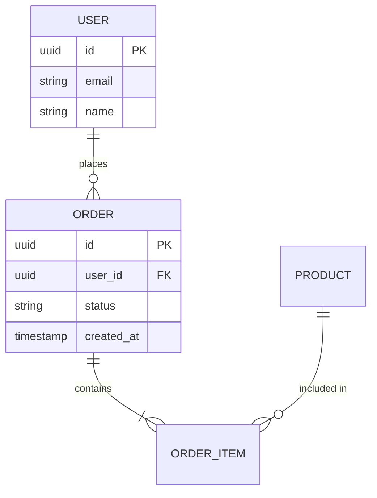
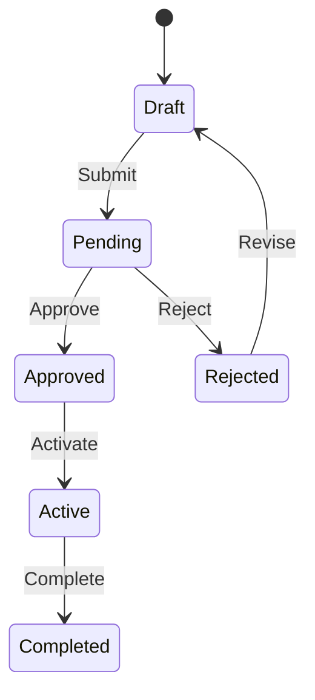

# Domain Glossary Discovery

> **Phase**: 1 - Constitution
> **Objective**: Extract and document domain-specific terminology from the existing codebase

---

## 📥 Input Required

### From Previous Prompts:

- `.context/project-config.md` (from Phase 1)
- `.context/idea/business-model.md` (from previous prompt)

### From Discovery Sources:

| Information     | Tool Capability        | CLI | Code Analysis              |
| --------------- | ---------------------- | --- | -------------------------- |
| Entity names    | `[DB_TOOL]` schema     | -   | Model files, DB migrations |
| Business terms  | `[ISSUE_TRACKER_TOOL]` | -   | Code comments, enums       |
| Relationships   | `[DB_TOOL]`            | -   | Foreign keys, associations |
| States/statuses | -                      | -   | Enum files, constants      |

> Resolved via [DB_TOOL] and [ISSUE_TRACKER_TOOL] — see Tool Resolution in CLAUDE.md

---

## 🎯 Objective

Create a comprehensive glossary of domain terms that:

1. Helps QA understand business terminology
2. Ensures consistent language in test cases and bug reports
3. Maps technical names to business concepts

---

## 🔍 Discovery Process

### Step 1: Entity/Model Discovery

**Actions:**

1. Find model/entity files:

   ```bash
   # TypeScript/JavaScript projects
   find . -name "*.model.ts" -o -name "*.entity.ts" -o -name "*.schema.ts" 2>/dev/null

   # Prisma schema
   cat prisma/schema.prisma 2>/dev/null

   # TypeORM entities
   ls src/entities/ src/models/ 2>/dev/null
   ```

2. If database tool available:

   ```
   [DB_TOOL] List Tables:
     - schema: {from project database}
     - include: columns, types, constraints
   ```

   > Resolved via [DB_TOOL] — see Tool Resolution in CLAUDE.md

3. Extract entity names and their attributes

**Output format:**

```
Entity: [TechnicalName]
- Business name: [What users call it]
- Description: [What it represents]
- Key attributes: [Important fields]
```

### Step 2: Enum/Constant Discovery

**Actions:**

1. Find enum definitions:

   ```bash
   grep -r "enum\|const.*=" --include="*.ts" src/types/ src/constants/ 2>/dev/null
   ```

2. Look for status/state values:

   ```bash
   grep -r "status\|state\|type" --include="*.ts" -A5 src/
   ```

3. Check for business-specific constants:
   ```bash
   cat src/constants/*.ts src/config/constants.ts 2>/dev/null
   ```

**Output format:**

```
Enum: [Name]
Values:
- [VALUE_1]: [Business meaning]
- [VALUE_2]: [Business meaning]
```

### Step 3: Relationship Discovery

**Actions:**

1. Analyze foreign keys:

   ```bash
   # Prisma relations
   grep -A2 "@relation" prisma/schema.prisma 2>/dev/null

   # TypeORM relations
   grep -B2 -A2 "ManyToOne\|OneToMany\|ManyToMany" src/entities/*.ts 2>/dev/null
   ```

2. Map entity relationships:
   - One-to-One
   - One-to-Many
   - Many-to-Many

**Output format:**

```
[Entity A] --[relationship]--> [Entity B]
Example: User --has many--> Orders
```

### Step 4: Business Rule Discovery

**Actions:**

1. Look for validation logic:

   ```bash
   grep -r "validate\|check\|verify\|must\|should" --include="*.ts" src/services/
   ```

2. Check for business constraints:

   ```bash
   grep -r "throw.*Error\|throw new" --include="*.ts" -B2 src/
   ```

3. Review comments for business rules:
   ```bash
   grep -r "//.*business\|//.*rule\|//.*must" --include="*.ts" src/
   ```

**Output format:**

```
Rule: [Name]
- Description: [What it enforces]
- Found in: [File:line]
```

### Step 5: UI Terminology Discovery

**Actions:**

1. Check i18n/translation files:

   ```bash
   cat src/locales/en.json public/locales/en/*.json 2>/dev/null
   ```

2. Look at form labels and UI text:

   ```bash
   grep -r "label\|placeholder\|title" --include="*.tsx" src/components/
   ```

3. Review error messages:
   ```bash
   grep -r "message.*:" --include="*.ts" src/
   ```

---

## 📤 Output Generated

### Primary Output: `.context/idea/domain-glossary.md`

````markdown
# Domain Glossary - [Product Name]

> **Discovered from**: Code analysis, database schema, UI components
> **Discovery Date**: [Date]
> **Total Terms**: [Count]

---

## Core Entities

### [Entity Name 1]

| Aspect               | Value                                |
| -------------------- | ------------------------------------ |
| **Technical Name**   | `EntityName`                         |
| **Business Name**    | [What users call it]                 |
| **Description**      | [What it represents in the business] |
| **Table/Collection** | `table_name`                         |
| **Key Attributes**   | [List important fields]              |
| **Found In**         | [File path]                          |

**Relationships:**

- Has many: [Related entities]
- Belongs to: [Parent entities]

**Example:**

```json
{
  "id": "uuid",
  "name": "Example",
  "status": "active"
}
```
````

---

### [Entity Name 2]

[Same structure as above]

---

## Enumerations & Constants

### [Enum Name 1]

| Value     | Business Meaning | Usage Context    |
| --------- | ---------------- | ---------------- |
| `VALUE_1` | [What it means]  | [When it's used] |
| `VALUE_2` | [What it means]  | [When it's used] |
| `VALUE_3` | [What it means]  | [When it's used] |

**Found in:** `src/types/[file].ts`

---

### [Enum Name 2]

[Same structure as above]

---

## Business Rules

### Rule: [Rule Name]

| Aspect                | Value                        |
| --------------------- | ---------------------------- |
| **Description**       | [What the rule enforces]     |
| **Entities Affected** | [Which entities]             |
| **Validation**        | [How it's enforced in code]  |
| **Error Message**     | "[Actual error message]"     |
| **Found In**          | `src/services/[file].ts:123` |

**Example scenario:**

- Given: [Precondition]
- When: [Action that triggers rule]
- Then: [Expected outcome]

---

### Rule: [Rule Name 2]

[Same structure as above]

---

## Entity Relationships Diagram



---

## Terminology Mapping

### Technical → Business Terms

| Technical Term | Business Term        | Context                   |
| -------------- | -------------------- | ------------------------- |
| `user`         | Customer/Member      | End users of the platform |
| `order`        | Purchase/Transaction | User buying action        |
| `product`      | Item/Listing         | Things available to buy   |
| `subscription` | Membership/Plan      | Recurring payment         |

### Abbreviations & Acronyms

| Abbrev | Full Form          | Meaning       |
| ------ | ------------------ | ------------- |
| [TBD]  | [To Be Determined] | [Explanation] |

---

## Status/State Flows

### [Entity] Status Flow



---

## UI Labels Reference

### Form Fields

| Technical Field | UI Label      | Placeholder        |
| --------------- | ------------- | ------------------ |
| `email`         | Email Address | "Enter your email" |
| `firstName`     | First Name    | "John"             |

### Action Buttons

| Action   | Button Label        | Context         |
| -------- | ------------------- | --------------- |
| `submit` | "Submit" / "Save"   | Form submission |
| `delete` | "Delete" / "Remove" | Deletion action |

---

## Discovery Gaps

**Terms needing clarification:**

- [ ] [Term 1]: [Question about it]
- [ ] [Term 2]: [Question about it]

---

## QA Usage Guide

**When writing test cases:**

1. Use business terms in test descriptions
2. Reference this glossary for correct terminology
3. Map technical assertions to business expectations

**When reporting bugs:**

1. Use consistent terminology from this glossary
2. Reference entity names correctly
3. Include relevant status/state context

````

### Update CLAUDE.md:

```markdown
## Phase 1 Progress
- [x] business-model-discovery.md ✅
- [x] domain-glossary.md ✅
  - Entities discovered: [count]
  - Enums discovered: [count]
  - Business rules: [count]
````

---

## 🔗 Next Prompt

| Condition                | Next Prompt                                             |
| ------------------------ | ------------------------------------------------------- |
| Glossary complete        | `discovery/phase-2-architecture/prd-executive-summary.md` |
| Need database access     | Configure MCP, then continue                            |
| Missing business context | Ask user for clarification                              |

---

## Tips

1. **Prioritize core entities** - Focus on main business objects first
2. **Include technical AND business names** - Bridge dev and business language
3. **Document relationships visually** - Mermaid diagrams help understanding
4. **Capture state flows** - Critical for test scenarios
5. **Link to code** - Include file paths for traceability
