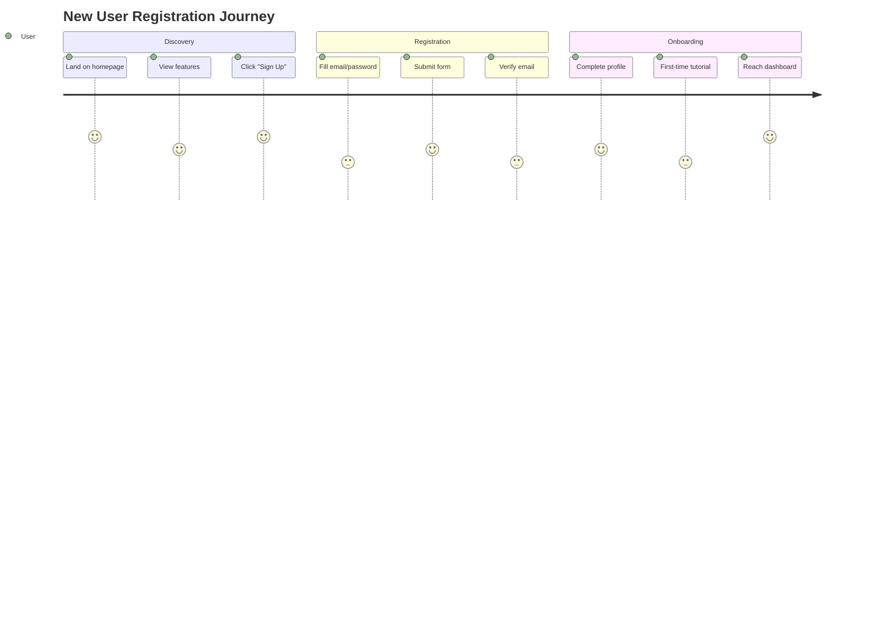
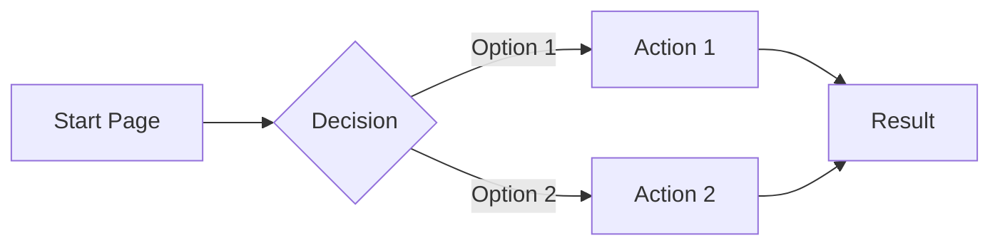
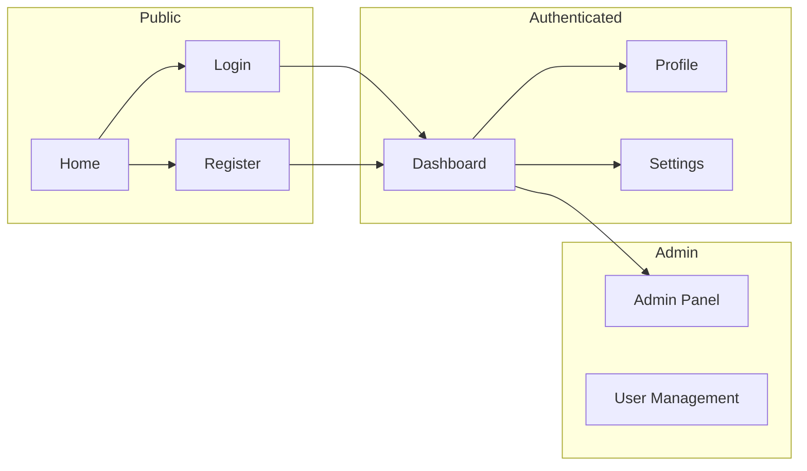

# PRD: User Journeys Discovery

> **Phase**: 2 - Architecture
> **Objective**: Map existing user flows from routes, navigation, and UI components

---

## 📥 Input Required

### From Previous Prompts:

- `.context/PRD/executive-summary.md` (core features)
- `.context/PRD/user-personas.md` (user types)

### From Discovery Sources:

| Information       | Primary Source            | Fallback             |
| ----------------- | ------------------------- | -------------------- |
| Route structure   | App router, page files    | File system analysis |
| Navigation paths  | Nav components, menus     | Link analysis        |
| User flows        | Form sequences, wizards   | Component hierarchy  |
| State transitions | URL params, query strings | State management     |

---

## 🎯 Objective

Map user journeys by analyzing:

1. Route definitions (what pages exist)
2. Navigation components (how users move between pages)
3. Form/wizard flows (multi-step processes)
4. Success/error states (flow outcomes)

---

## 🔍 Discovery Process

### Step 1: Route Structure Analysis

**Actions:**

1. Map all routes in the application:

   ```bash
   # Next.js App Router
   find src/app -name "page.tsx" -o -name "page.ts" | sort

   # Next.js Pages Router
   find src/pages -name "*.tsx" -o -name "*.ts" | grep -v "_app\|_document\|api" | sort

   # React Router (if used)
   grep -r "Route.*path\|<Route" --include="*.tsx" src/
   ```

2. Identify route groups/layouts:

   ```bash
   # Layout files (shared UI)
   find src/app -name "layout.tsx" | sort

   # Route groups
   ls -d src/app/*/ | grep -E "\(.*\)"
   ```

3. Map dynamic routes:
   ```bash
   # Dynamic segments [param]
   find src/app -type d -name "\[*\]"
   ```

**Output:**

```
/                    → Landing/Home
/auth/login          → Login flow
/auth/register       → Registration flow
/dashboard           → Main dashboard
/dashboard/[id]      → Detail view
/settings            → User settings
```

### Step 2: Navigation Analysis

**Actions:**

1. Find navigation components:

   ```bash
   # Look for nav, menu, sidebar components
   find src/components -name "*nav*" -o -name "*menu*" -o -name "*sidebar*"

   # Analyze main navigation
   grep -A20 "nav\|Nav\|navigation" src/components/layout/*.tsx 2>/dev/null
   ```

2. Extract navigation items:

   ```bash
   # Links in navigation
   grep -r "href=\|to=\|Link" --include="*.tsx" src/components/nav* src/components/header* 2>/dev/null
   ```

3. Identify conditional navigation (role-based):
   ```bash
   grep -r "role.*&&\|isAdmin.*&&\|can.*&&" --include="*.tsx" src/components/nav*
   ```

**Output:**

- Primary navigation paths
- Secondary navigation
- Role-specific navigation

### Step 3: Flow Analysis

**Actions:**

1. Find multi-step processes:

   ```bash
   # Wizards, steppers
   grep -r "step\|wizard\|stepper\|progress" --include="*.tsx" src/components/

   # Form sequences
   grep -r "onSubmit.*next\|handleNext" --include="*.tsx" src/
   ```

2. Analyze form submissions:

   ```bash
   # Form actions
   grep -r "action=\|onSubmit\|handleSubmit" --include="*.tsx" src/components/ src/app/
   ```

3. Find redirect patterns:
   ```bash
   # Redirects after actions
   grep -r "redirect\|push\|replace\|router\." --include="*.ts" --include="*.tsx" src/
   ```

**Output:**

- Multi-step flows (registration, checkout, etc.)
- Form → redirect patterns
- Success/error paths

### Step 4: Synthesize User Journeys

Create journey maps for each persona's key workflows.

---

## 📤 Output Generated

### Primary Output: `.context/PRD/user-journeys.md`

````markdown
# User Journeys - [Product Name]

> **Discovered from**: Route structure, navigation components, form flows
> **Discovery Date**: [Date]
> **Total Journeys**: [Count]

---

## Route Map

### Public Routes (Unauthenticated)

| Route            | Page         | Purpose         |
| ---------------- | ------------ | --------------- |
| `/`              | Home/Landing | Entry point     |
| `/auth/login`    | Login        | Authentication  |
| `/auth/register` | Register     | New user signup |
| `/pricing`       | Pricing      | Plan comparison |

### Protected Routes (Authenticated)

| Route        | Page        | Requires | Purpose        |
| ------------ | ----------- | -------- | -------------- |
| `/dashboard` | Dashboard   | `user`   | Main workspace |
| `/profile`   | Profile     | `user`   | User settings  |
| `/admin`     | Admin Panel | `admin`  | Administration |

### Dynamic Routes

| Pattern               | Example              | Purpose            |
| --------------------- | -------------------- | ------------------ |
| `/[entity]/[id]`      | `/projects/123`      | Entity detail view |
| `/[entity]/[id]/edit` | `/projects/123/edit` | Entity edit        |

---

## Journey 1: New User Registration

**Persona**: [Primary User]
**Goal**: Create account and access the product
**Discovered from**: `/auth/register` flow analysis

### Flow Diagram


````

### Step-by-Step Flow

| Step | Page             | Action           | Next             | Evidence                         |
| ---- | ---------------- | ---------------- | ---------------- | -------------------------------- |
| 1    | `/`              | Click "Sign Up"  | `/auth/register` | `src/components/Header.tsx:45`   |
| 2    | `/auth/register` | Fill form        | Submit           | `src/app/auth/register/page.tsx` |
| 3    | `/auth/register` | Submit           | `/verify-email`  | Redirect in form handler         |
| 4    | `/verify-email`  | Click email link | `/onboarding`    | Email template                   |
| 5    | `/onboarding`    | Complete steps   | `/dashboard`     | Onboarding flow                  |

### Error Paths

| Error         | Handling                  | Evidence                    |
| ------------- | ------------------------- | --------------------------- |
| Email exists  | Show error, suggest login | Validation in `register.ts` |
| Weak password | Show requirements         | Zod schema validation       |
| Network error | Retry option              | Error boundary              |

### Success Criteria

- [ ] User can complete registration
- [ ] Email verification works
- [ ] Onboarding completes
- [ ] Dashboard is accessible

---

## Journey 2: [Core Feature Flow]

**Persona**: [User Type]
**Goal**: [What they want to accomplish]
**Discovered from**: [Route/component analysis]

### Flow Diagram



### Step-by-Step Flow

| Step | Page    | Action   | Next   | Evidence   |
| ---- | ------- | -------- | ------ | ---------- |
| 1    | [route] | [action] | [next] | [code ref] |
| 2    | [route] | [action] | [next] | [code ref] |

### Error Paths

| Error     | Handling      | Evidence   |
| --------- | ------------- | ---------- |
| [Error 1] | [How handled] | [Code ref] |

---

## Journey 3: Admin User Management

**Persona**: Admin
**Goal**: Manage users in the system
**Discovered from**: `/admin` routes analysis

[Same structure as above]

---

## Navigation Structure

### Primary Navigation



### Breadcrumb Patterns

| Path                      | Breadcrumb                          |
| ------------------------- | ----------------------------------- |
| `/dashboard/projects/123` | Dashboard > Projects > Project Name |
| `/admin/users/456/edit`   | Admin > Users > User Name > Edit    |

---

## Critical Paths

### Happy Paths (Must Work)

| Journey      | Start        | End                 | Business Impact  |
| ------------ | ------------ | ------------------- | ---------------- |
| Registration | `/`          | `/dashboard`        | User acquisition |
| Core Action  | `/dashboard` | Success state       | Value delivery   |
| Upgrade      | `/pricing`   | `/checkout/success` | Revenue          |

### Unhappy Paths (Must Handle)

| Scenario        | Expected Behavior   | Evidence         |
| --------------- | ------------------- | ---------------- |
| Session expired | Redirect to login   | Middleware check |
| 404 page        | Show friendly error | `not-found.tsx`  |
| Server error    | Show retry option   | Error boundary   |

---

## Discovery Gaps

**Flows needing clarification:**

| Flow        | Unknown          | Question            |
| ----------- | ---------------- | ------------------- |
| [Flow name] | [What's unclear] | [Question for user] |

---

## QA Relevance

### Critical E2E Test Scenarios

Based on discovered journeys:

| Priority | Scenario                      | Journey Reference |
| -------- | ----------------------------- | ----------------- |
| P0       | New user can register         | Journey 1         |
| P0       | User can complete core action | Journey 2         |
| P1       | Admin can manage users        | Journey 3         |
| P1       | Error states are handled      | Error paths       |

### Suggested Test Data

| Journey      | Test User     | Prerequisites |
| ------------ | ------------- | ------------- |
| Registration | New email     | None          |
| Core action  | Existing user | Logged in     |
| Admin        | Admin user    | Admin role    |

````

### Update CLAUDE.md:

```markdown
## Phase 2 Progress - PRD
- [x] prd-executive-summary.md ✅
- [x] prd-user-personas.md ✅
- [x] prd-user-journeys.md ✅
  - Journeys mapped: [count]
  - Critical paths: [count]
````

---

## 🔗 Next Prompt

| Condition             | Next Prompt                |
| --------------------- | -------------------------- |
| Journeys mapped       | `prd-feature-inventory.md` |
| Complex flows unclear | Trace with Playwright MCP  |
| Missing routes        | Check for lazy loading     |

---

## Tips

1. **Routes = Journey steps** - Each route is a potential step
2. **Redirects reveal flow** - Follow the `redirect()` calls
3. **Forms are transitions** - Submit handlers show next steps
4. **Errors are journeys too** - Map unhappy paths
