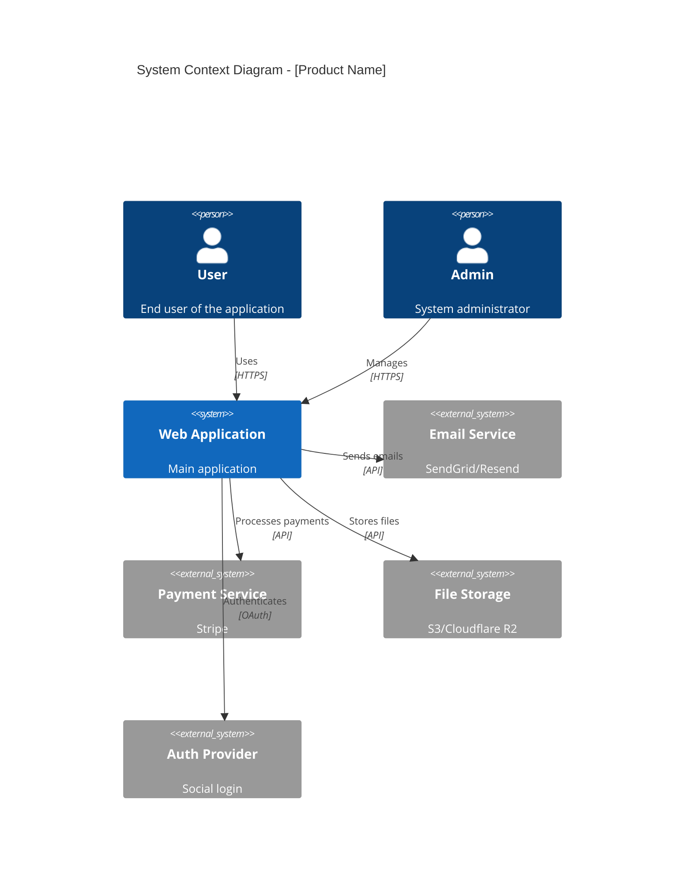
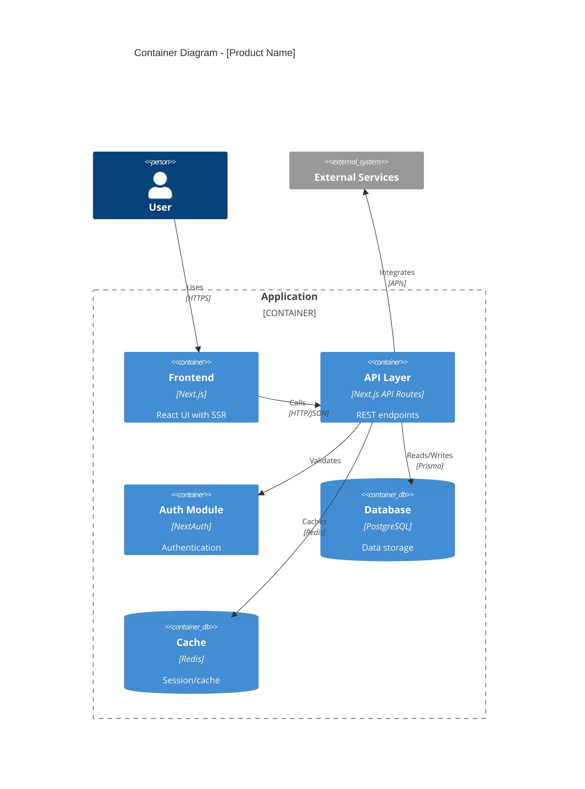
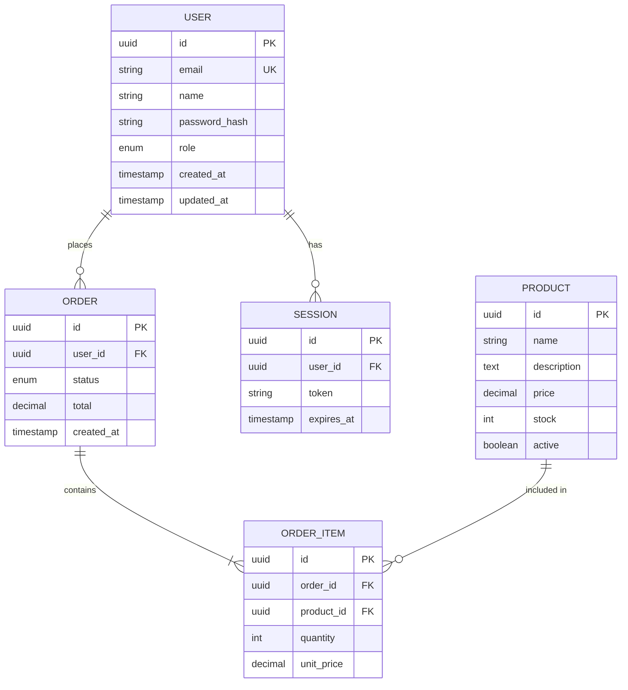
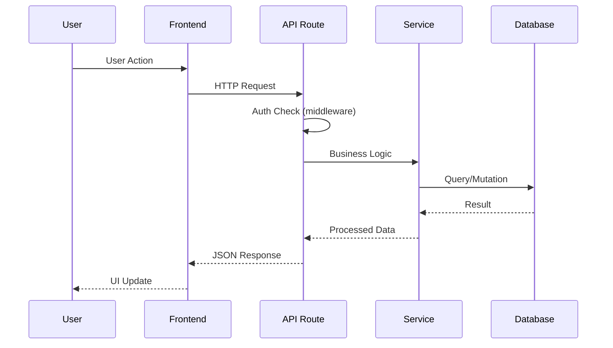
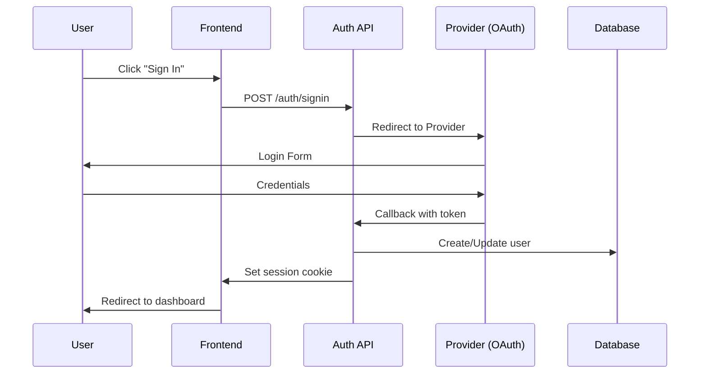

# SRS: Architecture Specs Discovery

> **Phase**: 2 - Architecture
> **Objective**: Document the existing system architecture from code analysis

---

## 📥 Input Required

### From Previous Prompts:

- `.context/project-config.md` (tech stack)
- `.context/PRD/feature-inventory.md` (features to map)

### From Discovery Sources:

| Information       | Primary Source                 | Fallback          |
| ----------------- | ------------------------------ | ----------------- |
| System components | Folder structure, package.json | Ask user          |
| Dependencies      | package.json, imports          | Yarn/npm analysis |
| Database schema   | Prisma/TypeORM, MCP            | Migration files   |
| External services | Config files, env vars         | Code analysis     |

---

## 🎯 Objective

Document the existing architecture by:

1. Mapping system components
2. Documenting data flow
3. Identifying dependencies
4. Creating visual diagrams (Mermaid)

---

## 🔍 Discovery Process

### Step 1: Component Discovery

**Actions:**

1. Analyze folder structure:

   ```bash
   # Top-level structure
   ls -la src/

   # Key directories
   ls src/app/ src/components/ src/services/ src/lib/ 2>/dev/null
   ```

2. Identify architectural patterns:

   ```bash
   # Look for common patterns
   ls src/controllers/ src/services/ src/repositories/ src/models/ 2>/dev/null

   # Check for modular structure
   ls src/modules/ src/features/ 2>/dev/null
   ```

3. Map component relationships:
   ```bash
   # Import analysis
   grep -r "from.*@/\|from.*src/" --include="*.ts" src/ | head -50
   ```

**Output:**

- Component list
- Directory purpose
- Architectural pattern (MVC, Clean, Feature-based)

### Step 2: Database Schema Discovery

**Actions:**

1. If database tool available:

   ```
   [DB_TOOL] Query Table Structure:
     - schema: public
   ```

   > Resolved via [DB_TOOL] — see Tool Resolution in CLAUDE.md

2. Analyze schema files:

   ```bash
   # Prisma schema
   cat prisma/schema.prisma 2>/dev/null

   # TypeORM entities
   cat src/entities/*.ts 2>/dev/null | head -100

   # Drizzle schema
   cat src/db/schema.ts 2>/dev/null
   ```

3. Check migrations for history:
   ```bash
   ls prisma/migrations/ migrations/ 2>/dev/null
   ```

**Output:**

- Entity list
- Relationships
- Field types

### Step 3: External Service Discovery

**Actions:**

1. Analyze environment variables:

   ```bash
   # Env template
   cat .env.example .env.template 2>/dev/null

   # Required external services
   grep -r "process.env\." --include="*.ts" src/ | grep -v "NODE_ENV" | sort | uniq
   ```

2. Check service configurations:

   ```bash
   # Service config files
   cat src/config/*.ts src/lib/config.ts 2>/dev/null
   ```

3. Identify SDK/client usage:
   ```bash
   # Client instantiations
   grep -r "new.*Client\|createClient\|initialize" --include="*.ts" src/
   ```

**Output:**

- External service list
- Configuration requirements
- Connection patterns

### Step 4: Generate Architecture Diagrams

Create Mermaid diagrams for:

- C4 Context (high-level)
- C4 Container (components)
- Entity Relationship (database)

---

## 📤 Output Generated

### Primary Output: `.context/SRS/architecture-specs.md`

````markdown
# Architecture Specs - [Product Name]

> **Discovered from**: Code structure, configs, database schema
> **Discovery Date**: [Date]
> **Architecture Pattern**: [Pattern name]

---

## System Overview

### Architecture Style

| Aspect       | Value                                |
| ------------ | ------------------------------------ |
| **Pattern**  | [e.g., Layered, Clean, Modular]      |
| **Frontend** | [e.g., Next.js App Router, SPA]      |
| **Backend**  | [e.g., API Routes, Separate service] |
| **Database** | [e.g., PostgreSQL via Supabase]      |
| **Hosting**  | [e.g., Vercel, AWS]                  |

### Tech Stack Summary

| Layer    | Technology   | Version   | Purpose         |
| -------- | ------------ | --------- | --------------- |
| Frontend | Next.js      | 14.x      | React framework |
| Styling  | Tailwind CSS | 3.x       | Utility CSS     |
| State    | Zustand      | 4.x       | Client state    |
| Backend  | Next.js API  | 14.x      | API routes      |
| ORM      | Prisma       | 5.x       | Database access |
| Database | PostgreSQL   | 15.x      | Data storage    |
| Auth     | NextAuth     | 5.x       | Authentication  |
| [Layer]  | [Tech]       | [Version] | [Purpose]       |

---

## C4 Context Diagram


````

---

## C4 Container Diagram



---

## Component Structure

### Directory Layout

```
src/
├── app/                    # Next.js App Router
│   ├── (auth)/            # Auth route group
│   ├── (dashboard)/       # Protected routes
│   ├── api/               # API routes
│   └── layout.tsx         # Root layout
├── components/            # React components
│   ├── ui/               # Base UI components
│   ├── forms/            # Form components
│   └── features/         # Feature components
├── lib/                   # Utilities
│   ├── db.ts             # Database client
│   ├── auth.ts           # Auth config
│   └── utils.ts          # Helper functions
├── services/             # Business logic
│   ├── user.service.ts   # User operations
│   └── [entity].service.ts
├── types/                # TypeScript types
└── hooks/                # React hooks
```

### Component Responsibilities

| Directory     | Responsibility          | Dependencies          |
| ------------- | ----------------------- | --------------------- |
| `app/`        | Routing, layouts, pages | components, services  |
| `components/` | UI rendering            | lib, hooks            |
| `services/`   | Business logic          | lib/db, external APIs |
| `lib/`        | Shared utilities        | None (leaf)           |
| `hooks/`      | React state logic       | services, lib         |

---

## Database Schema

### Entity Relationship Diagram



### Table Details

| Table         | Purpose          | Key Fields      | Relationships                   |
| ------------- | ---------------- | --------------- | ------------------------------- |
| `users`       | User accounts    | email, role     | Has many orders, sessions       |
| `orders`      | Purchase records | status, total   | Belongs to user, has many items |
| `products`    | Product catalog  | name, price     | Has many order items            |
| `order_items` | Order line items | quantity, price | Belongs to order and product    |

### Indexes (Discovered)

| Table   | Index             | Columns   | Purpose            |
| ------- | ----------------- | --------- | ------------------ |
| users   | `idx_users_email` | email     | Login lookup       |
| orders  | `idx_orders_user` | user_id   | User order history |
| [table] | [name]            | [columns] | [purpose]          |

---

## Data Flow

### Request Flow



### Authentication Flow



---

## External Services

### Service Dependencies

| Service    | Purpose           | Required            | Configuration       |
| ---------- | ----------------- | ------------------- | ------------------- |
| PostgreSQL | Data storage      | Yes                 | `DATABASE_URL`      |
| Redis      | Caching, sessions | Optional            | `REDIS_URL`         |
| Stripe     | Payments          | If payments enabled | `STRIPE_SECRET_KEY` |
| SendGrid   | Emails            | If email features   | `SENDGRID_API_KEY`  |
| S3/R2      | File storage      | If uploads          | `S3_*` vars         |

### Integration Points

| Service  | Endpoint                        | Data Exchanged |
| -------- | ------------------------------- | -------------- |
| Stripe   | `/api/webhooks/stripe`          | Payment events |
| SendGrid | N/A (outbound only)             | Email content  |
| OAuth    | `/api/auth/callback/[provider]` | User identity  |

---

## Security Architecture

### Authentication

| Aspect   | Implementation        |
| -------- | --------------------- |
| Method   | [Session-based / JWT] |
| Provider | [NextAuth / Custom]   |
| Password | [bcrypt / argon2]     |
| Session  | [Cookie / Token]      |

### Authorization

| Level | Implementation              |
| ----- | --------------------------- |
| Route | Middleware checks           |
| API   | Role-based guards           |
| Data  | Row-level security (if RLS) |

### Data Protection

| Aspect    | Implementation        |
| --------- | --------------------- |
| Transport | HTTPS enforced        |
| At Rest   | [Encryption status]   |
| PII       | [How handled]         |
| Secrets   | Environment variables |

---

## Performance Considerations

### Caching Strategy (Discovered)

| Layer | What's Cached | TTL    | Implementation    |
| ----- | ------------- | ------ | ----------------- |
| CDN   | Static assets | Long   | Vercel/Cloudflare |
| API   | Query results | [time] | [Redis/memory]    |
| DB    | Query cache   | [time] | [Database level]  |

### Identified Bottlenecks

| Area   | Evidence      | Recommendation |
| ------ | ------------- | -------------- |
| [Area] | [Code/config] | [Suggestion]   |

---

## Discovery Gaps

| Gap                | Impact                   | How to Resolve           |
| ------------------ | ------------------------ | ------------------------ |
| Cloud architecture | Deployment understanding | Check Vercel/AWS console |
| Exact versions     | Compatibility            | Check lock files         |
| [Gap]              | [Impact]                 | [Resolution]             |

---

## QA Relevance

### Architecture Testing Points

| Component         | Test Type   | Focus            |
| ----------------- | ----------- | ---------------- |
| API routes        | Integration | Request/response |
| Database          | Integration | Data integrity   |
| Auth flow         | E2E         | Security         |
| External services | Contract    | Mocking/stubs    |

### Environment Requirements

| Environment | Requirements        |
| ----------- | ------------------- |
| Unit tests  | No external deps    |
| Integration | Database, mocks     |
| E2E         | Full stack, test DB |

````

### Update CLAUDE.md:

```markdown
## Phase 2 Progress - SRS
- [x] srs-architecture-specs.md ✅
  - Pattern: [discovered]
  - Tables: [count]
  - External services: [count]
````

---

## 🔗 Next Prompt

| Condition               | Next Prompt                   |
| ----------------------- | ----------------------------- |
| Architecture documented | `srs-api-contracts.md`        |
| Missing DB access       | Configure MCP, document known |
| Complex architecture    | Create additional diagrams    |

---

## Tips

1. **Folder structure reveals architecture** - Directory layout = design decisions
2. **Package.json is truth** - Dependencies show real tech stack
3. **Env vars show integrations** - External services are in config
4. **Mermaid makes it visual** - Diagrams > descriptions
