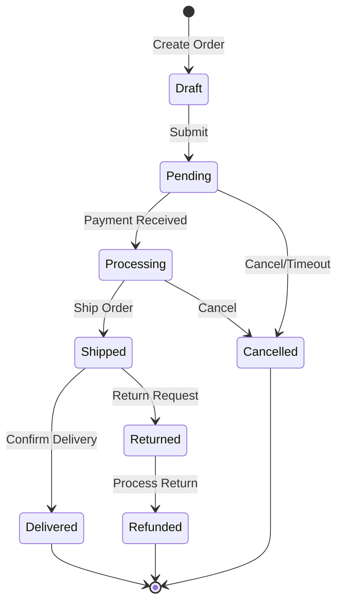
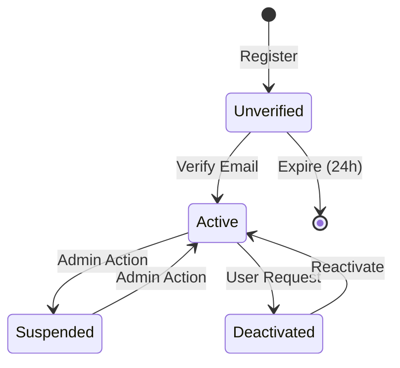

# SRS: Functional Specs Discovery

> **Phase**: 2 - Architecture
> **Objective**: Document functional requirements by analyzing existing behavior

---

## 📥 Input Required

### From Previous Prompts:

- `.context/PRD/feature-inventory.md` (features to spec)
- `.context/SRS/api-contracts.md` (API contracts)
- `.context/idea/domain-glossary.md` (business rules)

### From Discovery Sources:

| Information       | Primary Source    | Fallback             |
| ----------------- | ----------------- | -------------------- |
| Business logic    | Service files     | Controller analysis  |
| Validation rules  | Schema validators | Error messages       |
| State transitions | Enum definitions  | Database constraints |
| Edge cases        | Error handling    | Test files           |

---

## 🎯 Objective

Document functional specifications by:

1. Extracting business logic from service layer
2. Mapping validation rules
3. Documenting state machines
4. Identifying edge cases from error handling

---

## 🔍 Discovery Process

### Step 1: Service Layer Analysis

**Actions:**

1. Find service files:

   ```bash
   # Service layer
   find src -name "*.service.ts" -o -name "*Service.ts"

   # Business logic modules
   ls src/services/ src/lib/services/ 2>/dev/null
   ```

2. Extract main operations:

   ```bash
   # Public methods in services
   grep -r "async\|export.*function\|public" --include="*.service.ts" src/services/
   ```

3. Map service to feature:
   ```bash
   # Service dependencies
   grep -r "import.*service\|Service" --include="*.ts" src/app/api/
   ```

**Output:**

- Service operations list
- Business logic locations
- Feature-to-service mapping

### Step 2: Validation Rule Extraction

**Actions:**

1. Analyze Zod/Yup schemas:

   ```bash
   # Find all schemas
   find src -name "*.schema.ts" -o -name "*Schema.ts" -o -name "*validator.ts"

   # Extract validation rules
   grep -A10 "z\.\|yup\." src/schemas/*.ts 2>/dev/null
   ```

2. Extract custom validations:

   ```bash
   # Custom validation logic
   grep -r "validate\|isValid\|check" --include="*.ts" src/services/ src/lib/
   ```

3. Map validations to features:
   ```bash
   # Schema usage
   grep -r "parse\|safeParse\|validate" --include="*.ts" src/app/api/
   ```

**Output:**

- Validation rules per field
- Custom business validations
- Error messages

### Step 3: State Machine Discovery

**Actions:**

1. Find state enums:

   ```bash
   # Status/state enums
   grep -r "enum.*Status\|enum.*State\|type.*Status" --include="*.ts" src/types/
   ```

2. Analyze state transitions:

   ```bash
   # State change logic
   grep -r "status.*=\|setState\|updateStatus" --include="*.ts" src/services/
   ```

3. Check database constraints:
   ```bash
   # Check enums in schema
   grep -A5 "enum\|@Check" prisma/schema.prisma 2>/dev/null
   ```

**Output:**

- State definitions
- Valid transitions
- Transition conditions

### Step 4: Edge Case Discovery

**Actions:**

1. Analyze error handling:

   ```bash
   # Error types thrown
   grep -r "throw new\|throw.*Error" --include="*.ts" src/services/
   ```

2. Review test files for scenarios:

   ```bash
   # Test descriptions
   grep -r "it\(\|test\(\|describe\(" --include="*.test.ts" --include="*.spec.ts" src/
   ```

3. Check conditional logic:
   ```bash
   # Complex conditions
   grep -r "if.*&&\|if.*||" --include="*.ts" src/services/ | head -30
   ```

**Output:**

- Edge cases handled
- Error scenarios
- Test coverage hints

---

## 📤 Output Generated

### Primary Output: `.context/SRS/functional-specs.md`

````markdown
# Functional Specifications - [Product Name]

> **Discovered from**: Service layer, validators, state management
> **Discovery Date**: [Date]
> **Total FRs**: [Count]

---

## Specification Index

| ID     | Feature             | Category   | Priority   |
| ------ | ------------------- | ---------- | ---------- |
| FR-001 | User Registration   | Auth       | Critical   |
| FR-002 | User Authentication | Auth       | Critical   |
| FR-003 | [Feature]           | [Category] | [Priority] |

---

## FR-001: User Registration

### Overview

| Aspect         | Value                                 |
| -------------- | ------------------------------------- |
| **Feature**    | User Registration                     |
| **Related To** | PRD: Executive Summary, User Personas |
| **Service**    | `UserService.register()`              |
| **Evidence**   | `src/services/user.service.ts:45-89`  |

### Functional Requirement

The system shall allow new users to create an account with email and password.

### Input Specification

| Field      | Type   | Required | Validation                                    |
| ---------- | ------ | -------- | --------------------------------------------- |
| `email`    | string | Yes      | RFC 5321 format, max 254 chars                |
| `password` | string | Yes      | Min 8 chars, 1 uppercase, 1 number, 1 special |
| `name`     | string | No       | Max 100 chars, alphanumeric + spaces          |

### Validation Rules

```typescript
// Discovered from: src/schemas/user.schema.ts
const registrationSchema = z.object({
  email: z.string().email('Invalid email format').max(254, 'Email too long'),
  password: z
    .string()
    .min(8, 'Password must be at least 8 characters')
    .regex(/[A-Z]/, 'Must contain uppercase letter')
    .regex(/[0-9]/, 'Must contain number')
    .regex(/[!@#$%^&*]/, 'Must contain special character'),
  name: z
    .string()
    .max(100)
    .regex(/^[a-zA-Z\s]+$/)
    .optional(),
});
```
````

### Processing Logic

```
1. Validate input against schema
2. Check if email already exists in database
3. Hash password using bcrypt (12 rounds)
4. Generate email verification token
5. Create user record in database
6. Send verification email
7. Return user object (without password)
```

**Evidence:**

```typescript
// src/services/user.service.ts:45-89
async register(data: RegisterInput): Promise<User> {
  // Step 1: Validated by controller

  // Step 2: Check existing
  const existing = await this.db.user.findUnique({
    where: { email: data.email }
  });
  if (existing) {
    throw new ConflictError("Email already registered");
  }

  // Step 3: Hash password
  const passwordHash = await bcrypt.hash(data.password, 12);

  // Step 4-5: Create user
  const user = await this.db.user.create({
    data: {
      email: data.email,
      passwordHash,
      name: data.name,
      verificationToken: generateToken(),
    }
  });

  // Step 6: Send email
  await this.emailService.sendVerification(user);

  // Step 7: Return
  return this.sanitizeUser(user);
}
```

### Output Specification

**Success (201):**

```typescript
{
  user: {
    id: string;
    email: string;
    name: string | null;
    emailVerified: boolean; // false initially
    createdAt: string;
  }
}
```

**Errors:**

| Condition            | Error Code | Message                                  |
| -------------------- | ---------- | ---------------------------------------- |
| Invalid email format | 400        | "Invalid email format"                   |
| Password too weak    | 400        | "Password must be at least 8 characters" |
| Email exists         | 409        | "Email already registered"               |
| Server error         | 500        | "Registration failed"                    |

### Business Rules

| Rule   | Description            | Evidence                         |
| ------ | ---------------------- | -------------------------------- |
| BR-001 | Email must be unique   | Unique constraint on users.email |
| BR-002 | Password stored hashed | bcrypt with 12 rounds            |
| BR-003 | Verification required  | emailVerified defaults to false  |

### Edge Cases

| Scenario              | Expected Behavior     | Evidence                |
| --------------------- | --------------------- | ----------------------- |
| Email with spaces     | Trim and validate     | Schema preprocessing    |
| Unicode in name       | Allow limited unicode | Regex validation        |
| SQL injection attempt | Blocked by ORM        | Prisma parameterization |
| Empty string password | Rejected              | Min length validation   |

---

## FR-002: User Authentication

### Overview

| Aspect         | Value                                |
| -------------- | ------------------------------------ |
| **Feature**    | User Login                           |
| **Related To** | FR-001 (registration)                |
| **Service**    | `AuthService.login()`                |
| **Evidence**   | `src/services/auth.service.ts:23-67` |

### Functional Requirement

The system shall authenticate users via email and password.

### Input Specification

| Field        | Type    | Required | Validation     |
| ------------ | ------- | -------- | -------------- |
| `email`      | string  | Yes      | Valid email    |
| `password`   | string  | Yes      | Non-empty      |
| `rememberMe` | boolean | No       | Default: false |

### Processing Logic

```
1. Find user by email
2. If not found: return generic error (security)
3. Compare password hash
4. If mismatch: return generic error
5. Check if email verified (if required)
6. Generate session/token
7. Return user with token
```

### Security Considerations

| Concern          | Mitigation               | Evidence                                  |
| ---------------- | ------------------------ | ----------------------------------------- |
| Timing attack    | Constant-time comparison | bcrypt.compare                            |
| User enumeration | Generic error message    | Same message for not found/wrong password |
| Brute force      | Rate limiting            | Middleware                                |
| Session fixation | New session on login     | Session regeneration                      |

### State Transitions

| From State      | To State        | Condition         |
| --------------- | --------------- | ----------------- |
| Unauthenticated | Authenticated   | Valid credentials |
| Authenticated   | Authenticated   | Session refresh   |
| Authenticated   | Unauthenticated | Logout/expire     |

---

## FR-003: [Feature Name]

[Same structure as above]

---

## State Machines

### Order Status



**Transitions:**

| From       | To         | Trigger            | Guard           | Side Effects               |
| ---------- | ---------- | ------------------ | --------------- | -------------------------- |
| Draft      | Pending    | `submit()`         | Has items       | Send confirmation email    |
| Pending    | Processing | `processPayment()` | Payment success | Update inventory           |
| Processing | Shipped    | `ship()`           | Has tracking    | Send shipping notification |

**Evidence:** `src/services/order.service.ts:120-180`

### User Account Status



---

## Business Rules Summary

| ID     | Rule                    | Entities         | Enforcement         |
| ------ | ----------------------- | ---------------- | ------------------- |
| BR-001 | Email uniqueness        | User             | Database constraint |
| BR-002 | Password hashing        | User             | Service layer       |
| BR-003 | Order total calculation | Order, OrderItem | Computed on save    |
| BR-004 | Stock reservation       | Product, Order   | Transaction         |
| BR-005 | [Rule]                  | [Entities]       | [How enforced]      |

---

## Validation Rules Catalog

### User Entity

| Field    | Rules                             | Error Message       |
| -------- | --------------------------------- | ------------------- |
| email    | Required, email format, unique    | "Invalid email"     |
| password | Min 8, uppercase, number, special | "Password too weak" |
| name     | Max 100, alphanumeric             | "Invalid name"      |

### Order Entity

| Field           | Rules                 | Error Message               |
| --------------- | --------------------- | --------------------------- |
| items           | Min 1 item            | "Order must have items"     |
| total           | Positive number       | "Invalid total"             |
| shippingAddress | Required for physical | "Shipping address required" |

---

## Discovery Gaps

| Gap                    | Impact              | Resolution          |
| ---------------------- | ------------------- | ------------------- |
| Complex business rules | May miss edge cases | Review with team    |
| Implicit validations   | Test coverage gaps  | Add explicit checks |
| [Gap]                  | [Impact]            | [Resolution]        |

---

## QA Relevance

### Test Case Derivation

From FR-001 (Registration), derive test cases:

| TC ID  | Scenario           | Input                 | Expected              |
| ------ | ------------------ | --------------------- | --------------------- |
| TC-001 | Valid registration | Valid email, password | 201, user created     |
| TC-002 | Invalid email      | "not-an-email"        | 400, validation error |
| TC-003 | Weak password      | "12345678"            | 400, password rules   |
| TC-004 | Duplicate email    | Existing email        | 409, conflict         |
| TC-005 | Edge: long email   | 255 char email        | 400, too long         |

### Boundary Value Analysis

| Field           | Min | Max | Below Min | Above Max |
| --------------- | --- | --- | --------- | --------- |
| password length | 8   | 128 | TC-006    | TC-007    |
| name length     | 0   | 100 | N/A       | TC-008    |
| email length    | 1   | 254 | TC-009    | TC-010    |

````

### Update CLAUDE.md:

```markdown
## Phase 2 Progress - SRS
- [x] srs-architecture-specs.md ✅
- [x] srs-api-contracts.md ✅
- [x] srs-functional-specs.md ✅
  - FRs documented: [count]
  - Business rules: [count]
  - State machines: [count]
````

---

## 🔗 Next Prompt

| Condition              | Next Prompt                   |
| ---------------------- | ----------------------------- |
| FRs documented         | `srs-non-functional-specs.md` |
| Missing business rules | Check with team               |
| Complex state machines | Create separate diagrams      |

---

## Tips

1. **Service methods = Functional requirements** - Each method is an FR
2. **Validators = Specifications** - Zod schemas ARE the spec
3. **Error messages reveal edge cases** - Every error is a test case
4. **State enums show workflows** - Map transitions from code
