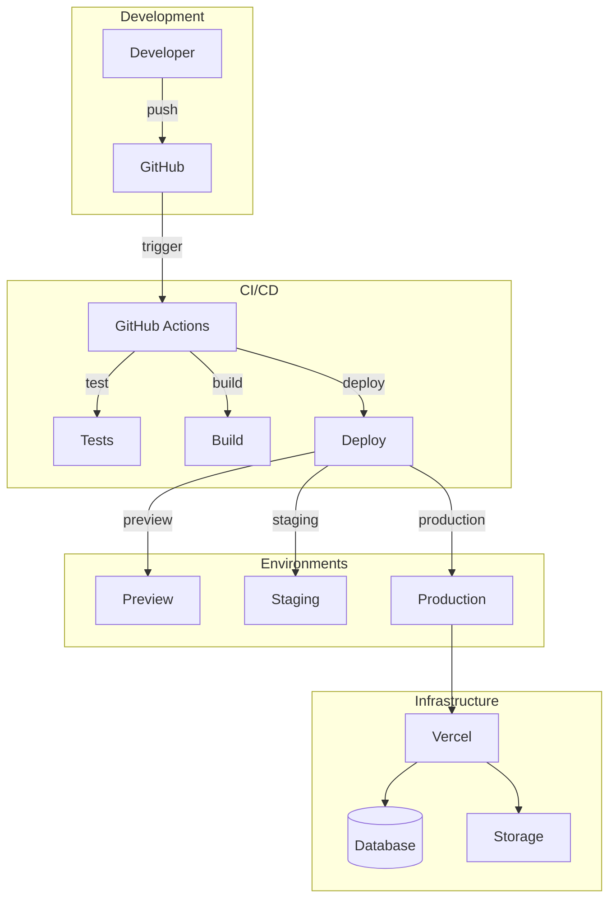
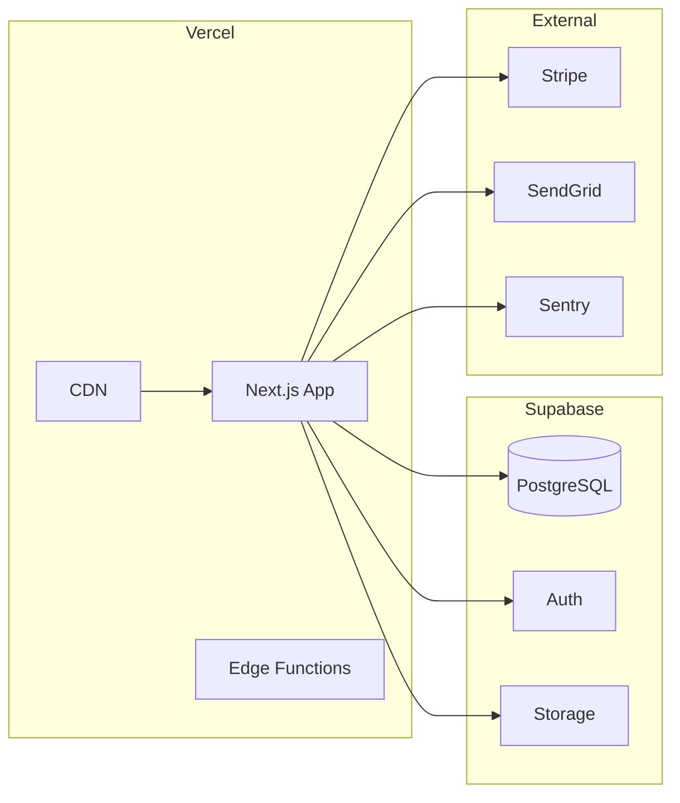

# Infrastructure Mapping

> **Phase**: 3 - Infrastructure
> **Objective**: Document CI/CD pipelines, deployment targets, and cloud infrastructure

---

## 📥 Input Required

### From Previous Prompts:

- `.context/project-config.md` (environments)
- Backend and frontend discovery (completed)

### From Discovery Sources:

| Information       | Primary Source             | Fallback            |
| ----------------- | -------------------------- | ------------------- |
| CI/CD pipelines   | .github/workflows/         | azure-pipelines.yml |
| Deployment config | vercel.json, netlify.toml  | Docker files        |
| Infrastructure    | terraform/, serverless.yml | Cloud console       |
| Environments      | CI/CD env vars             | .env files          |

---

## 🎯 Objective

Map existing infrastructure by:

1. Documenting CI/CD pipelines
2. Identifying deployment targets
3. Mapping environment configurations
4. Understanding infrastructure as code (if any)

---

## 🔍 Discovery Process

### Step 1: CI/CD Pipeline Discovery

**Actions:**

1. Find CI/CD configuration files:

   ```bash
   # GitHub Actions
   ls .github/workflows/ 2>/dev/null

   # Azure DevOps
   ls azure-pipelines.yml .azure-pipelines/ 2>/dev/null

   # GitLab CI
   ls .gitlab-ci.yml 2>/dev/null

   # CircleCI
   ls .circleci/config.yml 2>/dev/null
   ```

2. Analyze main workflow:

   ```bash
   cat .github/workflows/*.yml 2>/dev/null | head -100
   ```

3. Identify workflow triggers:

   ```bash
   grep -A5 "on:" .github/workflows/*.yml 2>/dev/null
   ```

4. Find workflow jobs and steps:
   ```bash
   grep -E "jobs:|steps:|run:|uses:" .github/workflows/*.yml 2>/dev/null | head -50
   ```

**Output:**

- CI/CD platform used
- Workflow files
- Triggers (push, PR, schedule)
- Jobs and steps

### Step 2: Deployment Target Discovery

**Actions:**

1. Check for platform-specific configs:

   ```bash
   # Vercel
   cat vercel.json 2>/dev/null

   # Netlify
   cat netlify.toml 2>/dev/null

   # Docker
   cat Dockerfile docker-compose.yml 2>/dev/null | head -50

   # Kubernetes
   ls k8s/ kubernetes/ helm/ 2>/dev/null
   ```

2. Check CI/CD for deployment steps:

   ```bash
   grep -E "deploy|Deploy|vercel|netlify|aws|gcp|azure" .github/workflows/*.yml 2>/dev/null
   ```

3. Identify deployment environments:
   ```bash
   grep -E "environment:|env:" .github/workflows/*.yml 2>/dev/null
   ```

**Output:**

- Hosting platform(s)
- Deployment method
- Environment names

### Step 3: Environment Configuration

**Actions:**

1. Find environment-specific configs:

   ```bash
   ls .env.* env.* 2>/dev/null
   ```

2. Check CI/CD environment variables:

   ```bash
   grep -E "env:|secrets\." .github/workflows/*.yml 2>/dev/null | head -30
   ```

3. Document environment URLs:
   ```bash
   # From CI/CD or config
   grep -E "URL|url|https://" .github/workflows/*.yml vercel.json 2>/dev/null
   ```

**Output:**

- Environment list (dev, staging, prod)
- Environment-specific variables
- URLs per environment

### Step 4: Infrastructure as Code Discovery

**Actions:**

1. Check for IaC tools:

   ```bash
   # Terraform
   ls *.tf terraform/ infra/ 2>/dev/null

   # Pulumi
   ls Pulumi.yaml 2>/dev/null

   # Serverless Framework
   ls serverless.yml serverless.ts 2>/dev/null

   # AWS CDK
   ls cdk.json lib/*.ts 2>/dev/null
   ```

2. Analyze infrastructure resources:
   ```bash
   grep -E "resource|aws_|google_|azurerm_" *.tf 2>/dev/null | head -20
   ```

**Output:**

- IaC tool (if any)
- Resources defined
- Cloud provider

---

## 📤 Output Generated

### Primary Output: `.context/SRS/infrastructure.md`

````markdown
# Infrastructure - [Product Name]

> **Discovered from**: CI/CD configs, deployment files, IaC
> **Discovery Date**: [Date]
> **Hosting**: [Platform]
> **CI/CD**: [Platform]

---

## Overview


````

---

## CI/CD Configuration

### Platform

| Aspect              | Value                |
| ------------------- | -------------------- |
| **Platform**        | GitHub Actions       |
| **Config Location** | `.github/workflows/` |
| **Workflows**       | [count] workflows    |

### Workflows

#### 1. CI Workflow (`ci.yml`)

**Triggers:**

```yaml
on:
  push:
    branches: [main, develop]
  pull_request:
    branches: [main]
```

**Jobs:**

| Job     | Purpose      | Runs On       | Duration |
| ------- | ------------ | ------------- | -------- |
| `lint`  | Code linting | ubuntu-latest | ~1min    |
| `test`  | Run tests    | ubuntu-latest | ~3min    |
| `build` | Build app    | ubuntu-latest | ~2min    |
| `e2e`   | E2E tests    | ubuntu-latest | ~5min    |

**Steps (test job):**

```yaml
steps:
  - uses: actions/checkout@v4
  - uses: actions/setup-node@v4
    with:
      node-version: '20'
      cache: 'npm'
  - run: npm ci
  - run: npm run lint
  - run: npm run test
  - run: npm run build
```

#### 2. Deploy Workflow (`deploy.yml`)

**Triggers:**

```yaml
on:
  push:
    branches: [main]
  workflow_dispatch:
```

**Environments:**

| Environment | Trigger         | Approval           |
| ----------- | --------------- | ------------------ |
| Preview     | PR              | Automatic          |
| Staging     | Push to develop | Automatic          |
| Production  | Push to main    | [Manual/Automatic] |

---

## Deployment Configuration

### Hosting Platform

| Aspect       | Value      |
| ------------ | ---------- |
| **Provider** | Vercel     |
| **Type**     | Serverless |
| **Region**   | [region]   |

### Vercel Configuration

```json
// vercel.json
{
  "buildCommand": "npm run build",
  "outputDirectory": ".next",
  "framework": "nextjs",
  "regions": ["iad1"],
  "env": {
    "DATABASE_URL": "@database-url"
  },
  "crons": [
    {
      "path": "/api/cron/cleanup",
      "schedule": "0 0 * * *"
    }
  ]
}
```

### Docker Configuration (if applicable)

```dockerfile
# Dockerfile summary
FROM node:20-alpine AS base
# Multi-stage build
# 1. deps - install dependencies
# 2. builder - build application
# 3. runner - production image

EXPOSE 3000
CMD ["node", "server.js"]
```

**Docker Compose Services:**

| Service | Image       | Ports | Purpose     |
| ------- | ----------- | ----- | ----------- |
| app     | Custom      | 3000  | Application |
| db      | postgres:15 | 5432  | Database    |
| redis   | redis:7     | 6379  | Cache       |

---

## Environments

### Environment Matrix

| Environment | URL                 | Branch  | Auto Deploy |
| ----------- | ------------------- | ------- | ----------- |
| Development | localhost:3000      | -       | -           |
| Preview     | pr-\*.vercel.app    | PR      | ✅          |
| Staging     | staging.example.com | develop | ✅          |
| Production  | example.com         | main    | ✅          |

### Environment Variables by Environment

| Variable       | Development | Staging     | Production  |
| -------------- | ----------- | ----------- | ----------- |
| `NODE_ENV`     | development | staging     | production  |
| `DATABASE_URL` | Local DB    | Staging DB  | Prod DB     |
| `API_URL`      | localhost   | staging-api | api.example |
| `LOG_LEVEL`    | debug       | info        | warn        |

### Secrets Management

| Secret            | Storage    | Access          |
| ----------------- | ---------- | --------------- |
| `DATABASE_URL`    | Vercel Env | Build + Runtime |
| `NEXTAUTH_SECRET` | Vercel Env | Runtime         |
| `STRIPE_SECRET`   | Vercel Env | Runtime         |

---

## Infrastructure Resources

### Cloud Services Used

| Service    | Provider    | Purpose             |
| ---------- | ----------- | ------------------- |
| Hosting    | Vercel      | Application hosting |
| Database   | Supabase    | PostgreSQL database |
| Storage    | S3/R2       | File storage        |
| CDN        | Vercel Edge | Static assets       |
| Email      | SendGrid    | Transactional email |
| Monitoring | Sentry      | Error tracking      |

### Database Infrastructure

| Aspect         | Value                          |
| -------------- | ------------------------------ |
| **Provider**   | Supabase                       |
| **Type**       | PostgreSQL 15                  |
| **Region**     | [region]                       |
| **Backups**    | Daily automatic                |
| **Connection** | Connection pooling (PgBouncer) |

### Diagram



---

## Infrastructure as Code (if applicable)

### Tool

| Aspect       | Value                    |
| ------------ | ------------------------ |
| **Tool**     | [Terraform/Pulumi/None]  |
| **Location** | `infra/` or `terraform/` |
| **State**    | [Remote/Local]           |

### Resources Defined

| Resource   | Type   | Purpose   |
| ---------- | ------ | --------- |
| [resource] | [type] | [purpose] |

---

## Monitoring & Observability

### Error Tracking

| Tool   | Coverage   | Alert Channel |
| ------ | ---------- | ------------- |
| Sentry | All errors | Slack #alerts |

### Uptime Monitoring

| Tool   | Endpoints   | Interval |
| ------ | ----------- | -------- |
| [Tool] | /api/health | 1 min    |

### Logging

| Environment | Destination | Retention |
| ----------- | ----------- | --------- |
| Development | Console     | Session   |
| Production  | [Service]   | 30 days   |

---

## Deployment Checklist

### Pre-Deployment

- [ ] All tests passing
- [ ] Build successful
- [ ] Environment variables set
- [ ] Database migrations ready

### Post-Deployment

- [ ] Health check passing
- [ ] Smoke tests passing
- [ ] Monitoring active
- [ ] Rollback plan ready

### Rollback Procedure

```bash
# Vercel rollback
vercel rollback [deployment-url]

# Or via dashboard
# Deployments → Select previous → Promote to Production
```

---

## Discovery Gaps

| Gap            | Impact              | Resolution          |
| -------------- | ------------------- | ------------------- |
| Cloud costs    | Budget planning     | Check cloud console |
| Scaling limits | Capacity planning   | Load testing        |
| DR plan        | Business continuity | Document with team  |

---

## QA Relevance

### Test Environment Setup

| Environment | Purpose             | Data           |
| ----------- | ------------------- | -------------- |
| Local       | Development         | Seed data      |
| CI          | Automated tests     | Test fixtures  |
| Staging     | Integration testing | Sanitized prod |

### CI/CD Integration Points

| Test Type   | CI Job | Blocking   |
| ----------- | ------ | ---------- |
| Unit tests  | `test` | ✅ Yes     |
| E2E tests   | `e2e`  | ✅ Yes     |
| Performance | [job]  | ⚠️ Warning |

### Environment Access for QA

| Environment | Access Method | Credentials    |
| ----------- | ------------- | -------------- |
| Staging     | Direct URL    | Test accounts  |
| Production  | Read-only     | Limited access |

````

### Update CLAUDE.md:

```markdown
## Phase 3 Progress
- [x] backend-discovery.md ✅
- [x] frontend-discovery.md ✅
- [x] infrastructure-mapping.md ✅
  - CI/CD: [platform]
  - Hosting: [platform]
  - Environments: [count]

## Phase 3 Complete ✅
Infrastructure documented in .context/SRS/infrastructure.md
````

---

## 🔗 Next Prompt

| Condition              | Next Prompt                      |
| ---------------------- | -------------------------------- |
| Infrastructure mapped  | `discovery/phase-4-specification/README.md` |
| Missing CI/CD          | Recommend setup                  |
| Complex infrastructure | Create additional diagrams       |

---

## Tips

1. **GitHub Actions are readable** - YAML workflows tell the whole story
2. **vercel.json/netlify.toml reveal hosting** - Platform configs are clear
3. **Check for IaC** - terraform/ or similar shows advanced setup
4. **CI env vars show secrets pattern** - How secrets are managed
