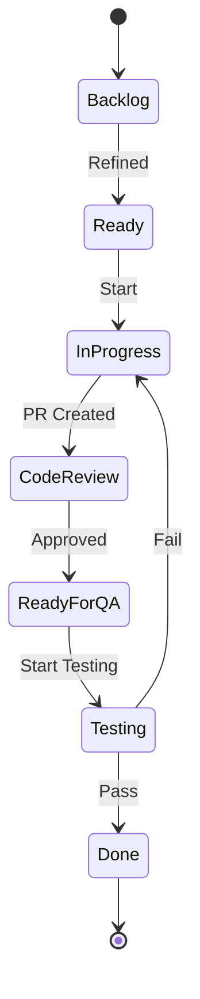

# PBI: Backlog Mapping

> **Phase**: 4 - Specification
> **Objective**: Map where the backlog lives and how to access it

---

## 📥 Input Required

### From Previous Prompts:

- `.context/project-config.md` (PM tool info)
- `.context/PRD/feature-inventory.md` (features to track)

### From User (if not in project-config):

- PM tool name (Jira, Azure DevOps, ClickUp, etc.)
- Project/board identifier
- Access credentials or MCP availability

---

## 🎯 Objective

Document backlog access by:

1. Identifying the PM tool used
2. Mapping project/board structure
3. Documenting access methods (MCP, CLI, API)
4. Establishing query patterns for common needs

**Remember**: Don't copy backlog content. Document HOW to access it.

---

## 🔍 Discovery Process

### Step 1: PM Tool Identification

**Actions:**

1. Check if already documented:

   ```bash
   grep -i "jira\|azure\|clickup\|linear\|asana" .context/project-config.md
   ```

2. Look for integrations in code:

   ```bash
   grep -r "jira\|atlassian\|azure.*devops" package.json .github/ 2>/dev/null
   ```

3. If unknown, ask user:
   ```
   "What tool do you use to manage your backlog? (Jira, Azure DevOps, ClickUp, Linear, etc.)"
   ```

**Output:**

- PM tool name
- Instance URL (if applicable)

### Step 2: Project Structure Mapping

**For Jira:**

1. With issue tracker tool:

   ```
   [ISSUE_TRACKER_TOOL] List Projects:
     - filter: {from user context}

   [ISSUE_TRACKER_TOOL] List Boards:
     - project: {{PROJECT_KEY}}
   ```

   > Resolved via [ISSUE_TRACKER_TOOL] — see Tool Resolution in CLAUDE.md

2. Without tool access, ask user:
   ```
   "What is the project key? (e.g., PROJ, MYAPP)"
   "What board type do you use? (Scrum/Kanban)"
   ```

**For Azure DevOps:**

1. With CLI:

   ```bash
   az boards project list
   az boards iteration list --project "ProjectName"
   ```

2. Ask user for organization and project name

**Output:**

- Project key/name
- Board type
- Sprint/iteration structure

### Step 3: Access Method Configuration

**Priority order:**

1. **MCP (Best)**: Rich integration, live queries
2. **CLI (Good)**: Scriptable, automation-friendly
3. **API (Fallback)**: Direct REST calls
4. **Manual (Last resort)**: Web UI only

**Check tool availability:**

```
Is [ISSUE_TRACKER_TOOL] available? → Use it
Has API token? → Use API
None → Document manual process
```

> Resolved via [ISSUE_TRACKER_TOOL] — see Tool Resolution in CLAUDE.md

**Output:**

- Primary access method
- Fallback method
- Required credentials/tokens

### Step 4: Query Patterns

**Common queries needed for QA:**

| Need                   | Jira JQL                               | Azure DevOps               |
| ---------------------- | -------------------------------------- | -------------------------- |
| Current sprint stories | `sprint = "Sprint X" AND type = Story` | `@CurrentIteration`        |
| Ready for testing      | `status = "Ready for QA"`              | `State = "Ready for Test"` |
| Bugs                   | `type = Bug AND project = X`           | `Work Item Type = Bug`     |
| My assigned            | `assignee = currentUser()`             | `@Me`                      |

Document these patterns for the specific project.

---

## 📤 Output Generated

### Primary Output: `.context/PBI/README.md`

````markdown
# Product Backlog Integration - [Product Name]

> **PM Tool**: [Jira/Azure DevOps/etc.]
> **Project**: [Key/Name]
> **Access Method**: [MCP/CLI/API]
> **Last Updated**: [Date]

---

## Backlog Location

| Aspect          | Value                               |
| --------------- | ----------------------------------- |
| **Tool**        | Jira Cloud                          |
| **URL**         | {{JIRA_URL}} |
| **Project Key** | [PROJECT_KEY]                       |
| **Board**       | [Board name]                        |
| **Board Type**  | Scrum / Kanban                      |

---

## Access Configuration

### Primary Method: Atlassian MCP

**Status**: ✅ Configured / ⚠️ Needs setup

**Setup instructions:**

```bash
# Add to MCP configuration
claude mcp add atlassian
# Configure with your credentials
```
````

**Available operations:**

- List projects via Atlassian MCP
- Get single issue
- Query issues with JQL
- Create issue
- Update issue

### Fallback Method: Issue Tracker CLI

> Ensure your issue tracker CLI is configured. See Tool Resolution in CLAUDE.md

**Common operations:**

```
[ISSUE_TRACKER_TOOL] List Issues:
  - project: {{PROJECT_KEY}}

[ISSUE_TRACKER_TOOL] View Issue:
  - key: {per TC naming convention}

[ISSUE_TRACKER_TOOL] Create Issue:
  - project: {{PROJECT_KEY}}
  - type: Story
  - summary: {from context}
```

> Resolved via [ISSUE_TRACKER_TOOL] — see Tool Resolution in CLAUDE.md

### API Access (if needed)

**Base URL:** `{{JIRA_URL}}/rest/api/3`

**Authentication:**

```bash
# Basic auth with API token
curl -u email@example.com:API_TOKEN \
  {{JIRA_URL}}/rest/api/3/issue/{{PROJECT_KEY}}-123
```

---

## Project Structure

### Issue Types

| Type     | Usage                     | Icon |
| -------- | ------------------------- | ---- |
| Epic     | Large features            | 🎯   |
| Story    | User-facing functionality | 📖   |
| Task     | Technical work            | ✅   |
| Bug      | Defects                   | 🐛   |
| Sub-task | Breakdown of parent       | 📋   |

### Workflow States



| Status       | Meaning         | QA Relevance      |
| ------------ | --------------- | ----------------- |
| Backlog      | Not refined     | Ignore            |
| Ready        | Ready for dev   | Review AC         |
| In Progress  | Being developed | Prepare tests     |
| Code Review  | PR open         | Review changes    |
| Ready for QA | Ready to test   | **START TESTING** |
| Testing      | Being tested    | Execute tests     |
| Done         | Complete        | Close test cycle  |

### Sprint Structure

| Sprint  | Dates   | Focus     |
| ------- | ------- | --------- |
| Current | [Dates] | [Goals]   |
| Next    | [Dates] | [Planned] |

---

## Common Queries

### For QA Work

| Need                         | JQL Query                                                                |
| ---------------------------- | ------------------------------------------------------------------------ |
| Current sprint, ready for QA | `project = PROJ AND sprint in openSprints() AND status = "Ready for QA"` |
| All bugs                     | `project = PROJ AND type = Bug ORDER BY priority DESC`                   |
| My testing tasks             | `project = PROJ AND status = Testing AND assignee = currentUser()`       |
| Recently updated             | `project = PROJ AND updated >= -1d ORDER BY updated DESC`                |

### Using Issue Tracker Tool

```
[ISSUE_TRACKER_TOOL] Query Issues:
  - project: {{PROJECT_KEY}}
  - status: "Ready for QA"
  - type: Story

[ISSUE_TRACKER_TOOL] View Issue:
  - key: {per TC naming convention}

[ISSUE_TRACKER_TOOL] List Sprint Issues:
  - project: {{PROJECT_KEY}}
  - sprint: current
```

> Resolved via [ISSUE_TRACKER_TOOL] — see Tool Resolution in CLAUDE.md

---

## Integration with KATA Architecture

### When to Fetch from Backlog

| Phase    | What to Fetch      | Why                 |
| -------- | ------------------ | ------------------- |
| Phase 5  | Story details + AC | Create test plan    |
| Phase 10 | Bug reports        | Exploratory testing |
| Phase 11 | Completed stories  | Test documentation  |
| Phase 12 | Story tech details | Automation          |

### Local Storage Strategy

```
.context/PBI/
├── README.md              # This file (permanent)
├── templates/             # Story/bug templates (permanent)
└── [sprint-name]/         # Current sprint work (temporary)
    ├── PROJ-123/          # Story being tested
    │   ├── story.md       # Fetched story details
    │   ├── test-plan.md   # Test plan
    │   └── test-cases.md  # Test cases
    └── PROJ-124/
```

**Cleanup rule:** Delete sprint folders after sprint ends. Story details can always be re-fetched.

---

## Credentials & Security

### Required Credentials

| Credential     | Storage              | Purpose        |
| -------------- | -------------------- | -------------- |
| Jira API Token | Environment variable | API/CLI access |
| Jira Email     | Environment variable | Authentication |

### Environment Variables

```bash
# .env.local (never commit)
JIRA_API_TOKEN=your-api-token
JIRA_EMAIL=your-email@example.com
JIRA_URL={{JIRA_URL}}
```

### MCP Configuration

```json
// claude_desktop_config.json
{
  "mcpServers": {
    "atlassian": {
      "command": "npx",
      "args": ["-y", "@anthropic/mcp-atlassian"],
      "env": {
        "JIRA_URL": "{{JIRA_URL}}",
        "JIRA_EMAIL": "your-email@example.com",
        "JIRA_API_TOKEN": "your-token"
      }
    }
  }
}
```

---

## Quick Reference

### Fetch a Story for Testing

```
# 1. Get story details
[ISSUE_TRACKER_TOOL] View Issue:
  - key: {per TC naming convention}
  - format: plain

# 2. Create local folder
mkdir -p .context/PBI/sprint-X/{TICKET-ID}

# 3. Save story details to local context

# 4. Create test plan using Phase 5 prompts
```

### Report a Bug

```
[ISSUE_TRACKER_TOOL] Create Issue:
  - project: {{PROJECT_KEY}}
  - type: Bug
  - summary: {from defect analysis}
  - description: {from reproduction steps}
```

> Resolved via [ISSUE_TRACKER_TOOL] — see Tool Resolution in CLAUDE.md

---

## Troubleshooting

| Issue                    | Solution                             |
| ------------------------ | ------------------------------------ |
| Tool not connecting      | Check credentials, verify URL        |
| Authentication error     | Reconfigure tool credentials         |
| Permission denied        | Verify project access                |
| Query syntax error       | Test query in issue tracker UI first |

````

### Update CLAUDE.md:

```markdown
## Phase 4 Progress
- [x] pbi-backlog-mapping.md ✅
  - PM Tool: [Jira/Azure DevOps/etc.]
  - Project: [key]
  - Access: [MCP/CLI/API]
````

---

## 🔗 Next Prompt

| Condition         | Next Prompt               |
| ----------------- | ------------------------- |
| Backlog mapped    | `pbi-story-template.md`   |
| MCP not available | Document API/CLI fallback |
| Need credentials  | Ask user for setup        |

---

## Tips

1. **Don't duplicate the backlog** - Reference it, don't copy it
2. **MCP is ideal** - Rich, live integration
3. **CLI is scriptable** - Good for automation
4. **Document queries** - You'll use them repeatedly
